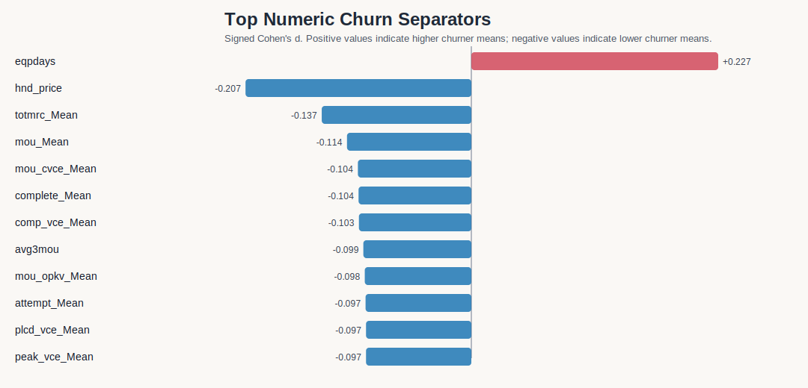
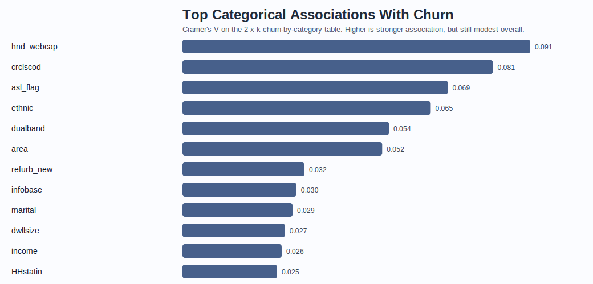
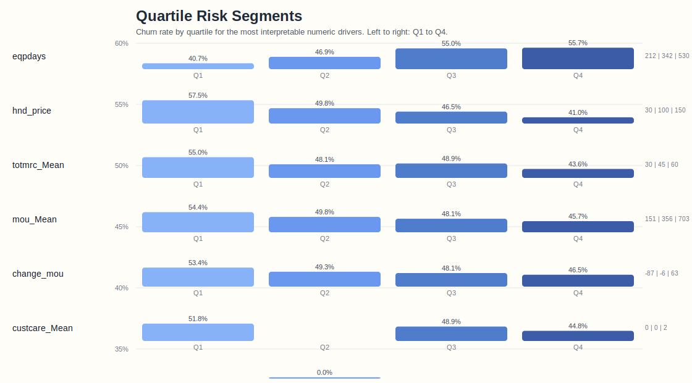

# Bivariate EDA

This section compares churners and non-churners across the strongest behavioral, revenue, service-quality, household, device, and demographic features.
The dataset is large enough that many small differences are statistically significant, so the report emphasizes both significance and effect size.

## Visual Summary

# Revenue Drivers

- The cleanest revenue-related separator is `hnd_price`: churners average 95.54 vs 108.13 for non-churners, and the lowest handset-price quartile churns at 57.5% versus 41.0% in the highest quartile.
- `totmrc_Mean` also separates the classes: churners average 44.54 vs 47.78.
- Lifetime and recent revenue (`rev_Mean`, `avg3rev`, `avg6rev`) are significant but materially weaker than device price and usage trend features.

| Feature | Non-churn mean | Churn mean | Cohen's d | p-value | Interpretation |
|---|---:|---:|---:|---:|---|
| `hnd_price` | 108.13 | 95.54 | -0.207 | 4.4e-234 | Lower in churn; Strongest numeric separation |
| `totmrc_Mean` | 47.78 | 44.54 | -0.137 | 1.8e-104 | Lower in churn; Moderate separation |
| `rev_Mean` | 59.22 | 58.21 | -0.022 | 0.0006 | Lower in churn; Very weak separation |
| `avg3rev` | 59.78 | 58.59 | -0.025 | 0.0001 | Lower in churn; Very weak separation |
| `avg6rev` | 59.45 | 57.92 | -0.038 | 5.0e-09 | Lower in churn; Very weak separation |

# Usage Drivers

- `mou_Mean` and `avg3mou` both point in the expected direction: churners use less on average, and the `mou_Mean` quartiles show a clean gradient from 54.4% churn in Q1 to 45.7% in Q4.
- `change_mou` is directionally useful as well: the median churner shows a more negative change than the median non-churner (-10.0 vs -3.0).
- `months` is not a clean protective factor; it is weakly non-monotonic in quartiles, so tenure alone should not be treated as a churn shield.
- Missingness matters for `change_mou` and `change_rev`: each is missing about 0.42% of non-churners versus 1.37% of churners, so the absence of the trend fields is itself a warning signal.

| Feature | Non-churn mean | Churn mean | Cohen's d | p-value | Interpretation |
|---|---:|---:|---:|---:|---|
| `eqpdays` | 363.28 | 421.09 | +0.227 | 1.7e-281 | Higher in churn; Strongest numeric separation |
| `mou_Mean` | 543.21 | 483.31 | -0.114 | 9.1e-73 | Lower in churn; Moderate separation |
| `avg3mou` | 545.85 | 492.97 | -0.099 | 1.6e-55 | Lower in churn; Weak separation |
| `change_mou` | -5.34 | -22.76 | -0.063 | 3.8e-23 | Lower in churn; Weak separation |
| `months` | 18.63 | 19.04 | +0.042 | 3.1e-11 | Higher in churn; Very weak separation |

# Service Quality Drivers

- Service-quality metrics are statistically significant but much weaker than device age and usage trend variables.
- The strongest surprise is `custcare_Mean`: churners show *fewer* customer-care minutes/calls on average (1.60 vs 1.98), so the naive “more support calls equals more churn” story does not hold in raw form.
- Voice and data drop/block variables move only slightly, which suggests service problems matter, but they do not dominate the univariate separation on their own.

| Feature | Non-churn mean | Churn mean | Cohen's d | p-value | Interpretation |
|---|---:|---:|---:|---:|---|
| `custcare_Mean` | 1.98 | 1.60 | -0.073 | 1.0e-30 | Lower in churn; Weak separation |
| `drop_vce_Mean` | 6.09 | 5.82 | -0.031 | 0.0000 | Lower in churn; Very weak separation |
| `blck_vce_Mean` | 4.12 | 3.93 | -0.018 | 0.0043 | Lower in churn; Very weak separation |
| `drop_dat_Mean` | 0.05 | 0.04 | -0.012 | 0.0476 | Lower in churn; Very weak separation |
| `blck_dat_Mean` | 0.03 | 0.02 | -0.008 | 0.2013 | Lower in churn; Very weak separation |

# Household Drivers

- Household variables add segmentation value, but their standalone association with churn is small compared with device and usage signals.
- Missing household information is common in several fields, so these features are better treated as supporting context than as primary churn drivers.

| Feature | Cramér's V | Highest-risk category | Churn rate | Lowest-risk category | Churn rate | Readout |
|---|---:|---|---:|---|---:|---|
| `income` | 0.026 | `Missing` | 51.4% | `2` | 47.1% | Weak signal |
| `ownrent` | 0.023 | `R` | 51.9% | `O` | 48.7% | Weak signal |
| `dwlltype` | 0.025 | `Missing` | 51.2% | `S` | 48.4% | Weak signal |
| `HHstatin` | 0.025 | `H` | 52.2% | `B` | 48.0% | Weak signal |
| `dwllsize` | 0.027 | `I` | 53.4% | `L` | 45.9% | Weak signal |

# Device Drivers

- Device-related categorical fields are among the strongest categorical signals in the dataset.
- `hnd_webcap` is the strongest categorical variable overall; missing web-capability information and the `WC` category are riskier than `WCMB`.
- `refurb_new` is mildly directional: refurbished devices churn at 53.4% versus 48.9% for new devices.
- `dualband` also matters, but its association is moderate rather than dominant.

| Feature | Cramér's V | Highest-risk category | Churn rate | Lowest-risk category | Churn rate | Readout |
|---|---:|---|---:|---|---:|---|
| `refurb_new` | 0.032 | `R` | 53.4% | `N` | 48.9% | Mild signal |
| `hnd_webcap` | 0.091 | `Missing` | 59.2% | `UNKW` | 36.6% | Material categorical signal |
| `dualband` | 0.054 | `N` | 53.7% | `U` | 34.7% | Mild signal |

# Demographic Drivers

- Demographic and location features are informative, but they do not beat the behavior and device signals.
- `crclscod` and `ethnic` are the strongest demographic-style categoricals; some classes are materially riskier than others.
- `area` also matters, with the Northwest/Rocky Mountain area and South Florida showing higher churn than the Midwest and DC/Maryland/Virginia area.

| Feature | Cramér's V | Highest-risk category | Churn rate | Lowest-risk category | Churn rate | Readout |
|---|---:|---|---:|---|---:|---|
| `crclscod` | 0.081 | `A2` | 61.6% | `E4` | 30.6% | Material categorical signal |
| `area` | 0.052 | `NORTHWEST/ROCKY MOUNTAIN AREA` | 56.9% | `MIDWEST AREA` | 45.9% | Mild signal |
| `ethnic` | 0.065 | `O` | 58.1% | `C` | 31.6% | Material categorical signal |
| `prizm_social_one` | 0.024 | `R` | 52.7% | `U` | 48.5% | Weak signal |
| `asl_flag` | 0.069 | `N` | 51.0% | `Y` | 40.9% | Material categorical signal |

# Top Churn Indicators

The strongest indicators are dominated by device age, handset price, usage, and recent trend variables. Categorical effects are present, but they are smaller than the leading numeric separators.

## Numeric Ranking

| Rank | Feature | Cohen's d | Non-churn mean | Churn mean | Significance |
|---:|---|---:|---:|---:|---|
| 1 | `eqpdays` | +0.227 | 363.28 | 421.09 | 1.7e-281 |
| 2 | `hnd_price` | -0.207 | 108.13 | 95.54 | 4.4e-234 |
| 3 | `totmrc_Mean` | -0.137 | 47.78 | 44.54 | 1.8e-104 |
| 4 | `mou_Mean` | -0.114 | 543.21 | 483.31 | 9.1e-73 |
| 5 | `mou_cvce_Mean` | -0.104 | 241.40 | 213.88 | 4.7e-61 |
| 6 | `complete_Mean` | -0.104 | 115.80 | 103.42 | 2.1e-60 |
| 7 | `comp_vce_Mean` | -0.103 | 114.95 | 102.72 | 5.1e-60 |
| 8 | `avg3mou` | -0.099 | 545.85 | 492.97 | 1.6e-55 |
| 9 | `mou_opkv_Mean` | -0.098 | 176.78 | 153.57 | 4.1e-54 |
| 10 | `attempt_Mean` | -0.097 | 153.42 | 137.95 | 2.4e-53 |

## Categorical Ranking

| Rank | Feature | Cramér's V | Highest-risk category | Churn rate | Risk lift |
|---:|---|---:|---|---:|---:|
| 1 | `hnd_webcap` | 0.091 | `Missing` | 59.2% | 1.19x |
| 2 | `crclscod` | 0.081 | `A2` | 61.6% | 1.24x |
| 3 | `asl_flag` | 0.069 | `N` | 51.0% | 1.03x |
| 4 | `ethnic` | 0.065 | `O` | 58.1% | 1.17x |
| 5 | `dualband` | 0.054 | `N` | 53.7% | 1.08x |
| 6 | `area` | 0.052 | `NORTHWEST/ROCKY MOUNTAIN AREA` | 56.9% | 1.15x |
| 7 | `refurb_new` | 0.032 | `R` | 53.4% | 1.08x |
| 8 | `infobase` | 0.030 | `Missing` | 52.0% | 1.05x |

# Hypothesis Validation Results

| Hypothesis | Evidence | Verdict |
|---|---|---|
| Older handset equipment increases churn risk | eqpdays is the strongest numeric separator; churn rises from 40.7% in Q1 to 55.7% in Q4. | Supported |
| Recent usage declines increase churn risk | mou_Mean, avg3mou, and change_mou all move in the expected direction; lower-usage quartiles churn more. | Supported |
| Recent revenue decline is a strong churn trigger | Direction is mostly as expected, but the effect is weaker than usage and device age; change_rev is close to noise. | Partially supported |
| More customer-care contact signals dissatisfaction | Observed raw churners actually have fewer customer-care minutes/calls on average, so the simple hypothesis is contradicted. | Not supported |
| Poor voice/data service increases churn | Voice/drop-block variables have only small effects; they are directionally weak and not a dominant separator. | Weak / partially supported |
| Higher-value customers should be prioritized | Lower handset price and lower recurring charge are more churn-prone, so saving higher-value accounts still makes business sense, but value is not the strongest statistical separator. | Supported in business terms |
| Household and demographic fields add material signal | Some categorical fields matter, but their V values are much smaller than device and behavior features. | Partially supported |
| Recent trend features are more useful than static demographics | Trend features generally outperform demographics in effect size and monotonicity. | Supported |
| Refurbished or less capable devices increase churn | Refurbished status and missing web-capability info are modestly riskier. | Supported, mildly |
| Tenure is a strong protective factor | months is weak and non-monotonic in quartiles, so tenure is not a clean standalone protector. | Not strongly supported |

# Key Findings

- `churn` is close to balanced at 49.6% vs 50.4%, so raw class imbalance is not the main challenge.
- The strongest numeric separator is `eqpdays` (+0.227); churn rises from 40.7% in the lowest quartile to 55.7% in the highest.
- The strongest categorical separator is `hnd_webcap` (Cramér's V = 0.091), followed closely by `crclscod`, `asl_flag`, `ethnic`, `dualband`, and `area`.
- Behavior and device variables beat household and demographic variables in raw bivariate signal, which is useful for feature prioritization.
- The main surprising result is that customer-care usage is not a positive churn predictor in this raw form; it moves slightly in the opposite direction.
- The missingness pattern on `change_mou` and `change_rev` is itself informative and should be preserved as a modeling signal.
