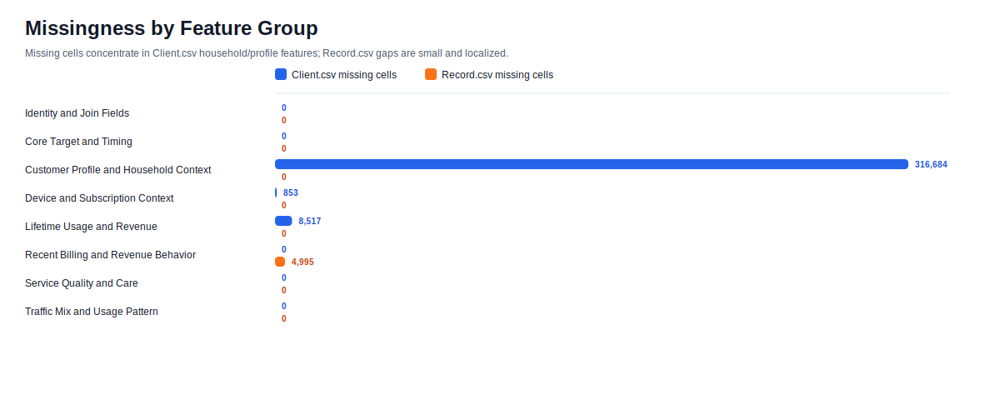
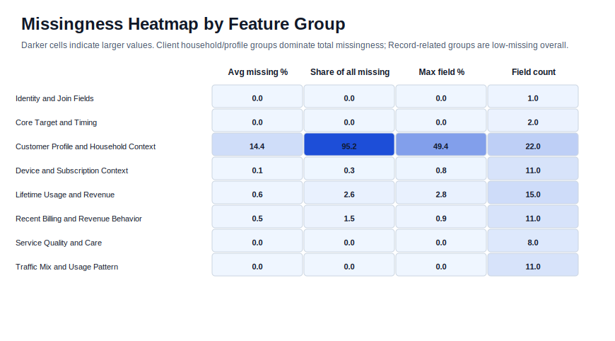
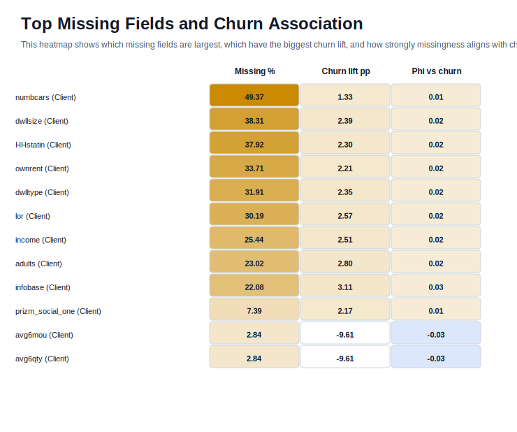
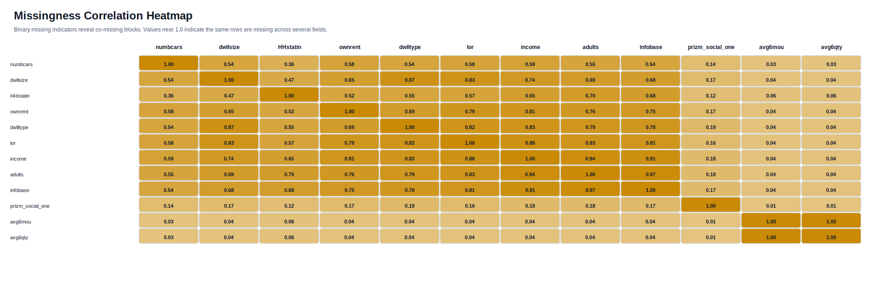
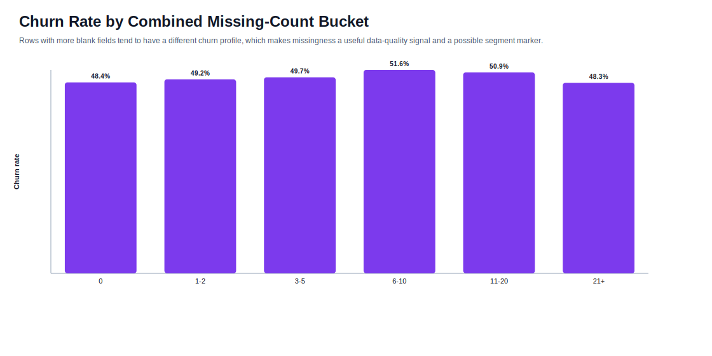

# Missingness EDA

This report measures missing values in the raw CSV files as blank cells. No imputation was applied.

## Missingness Overview

| Dataset | Rows | Columns | Missing Cells | Missing Rate | Rows With Any Missing | Fields With Missing |
|---|---:|---:|---:|---:|---:|---:|
| `Client.csv` | 100,000 | 50 | 327,786 | 6.56% | 69,149 | 32 |
| `Record.csv` | 100,000 | 51 | 4,995 | 0.10% | 891 | 11 |
| Combined raw tables | 200,000 | 101 | 332,781 | 3.29% | 69,349 | 43 |

- `Client.csv` accounts for **98.5%** of all missing cells.
- `Record.csv` accounts for **1.5%** of all missing cells.
- Overall churn remains nearly balanced at **49.56%**.

### Missingness Patterns

Several fields share exactly the same missing rows, which indicates structured gaps rather than scattered random blanks:

- `creditcd`, `truck`, `rv`, `marital`, `forgntvl`, `ethnic`, `kid0_2`, `kid3_5`, `kid6_10`, `kid11_15`, `kid16_17` are missing together in **1,732** rows (1.73%).
- `avg6mou`, `avg6qty`, `avg6rev` are missing together in **2,839** rows (2.84%).
- `da_Mean`, `rev_Mean`, `mou_Mean`, `totmrc_Mean`, `ovrmou_Mean`, `ovrrev_Mean`, `vceovr_Mean`, `datovr_Mean`, `roam_Mean` are missing together in **357** rows (0.36%).
- `change_mou`, `change_rev` are missing together in **891** rows (0.89%).

The strongest repeated patterns are:

| Pattern block | Features | Rows missing | Missing % |
|---|---|---:|---:|
| Client block | `creditcd`, `truck`, `rv`, `marital`, `forgntvl`, `ethnic`, `kid0_2`, `kid3_5`, `kid6_10`, `kid11_15`, `kid16_17` | 1,732 | 1.73% |
| Client block | `avg6mou`, `avg6qty`, `avg6rev` | 2,839 | 2.84% |
| Record block | `da_Mean`, `rev_Mean`, `mou_Mean`, `totmrc_Mean`, `ovrmou_Mean`, `ovrrev_Mean`, `vceovr_Mean`, `datovr_Mean`, `roam_Mean` | 357 | 0.36% |
| Record block | `change_mou`, `change_rev` | 891 | 0.89% |

## Missingness by Feature Group

| Feature Group | Fields | Missing Cells | Share of All Missing | Avg Missing per Field | Most Affected Field |
|---|---:|---:|---:|---:|---|
| Customer Profile and Household Context | 22 | 316,684 | 95.16% | 14.39% | `numbcars` (49.37%) |
| Lifetime Usage and Revenue | 15 | 8,517 | 2.56% | 0.57% | `avg6mou` (2.84%) |
| Recent Billing and Revenue Behavior | 11 | 4,995 | 1.50% | 0.45% | `change_mou` (0.89%) |
| Device and Subscription Context | 11 | 853 | 0.26% | 0.08% | `hnd_price` (0.85%) |
| Identity and Join Fields | 1 | 0 | 0.00% | 0.00% | `Customer_ID` (0.00%) |
| Core Target and Timing | 2 | 0 | 0.00% | 0.00% | `churn` (0.00%) |
| Service Quality and Care | 8 | 0 | 0.00% | 0.00% | `drop_vce_Mean` (0.00%) |
| Traffic Mix and Usage Pattern | 11 | 0 | 0.00% | 0.00% | `mou_cvce_Mean` (0.00%) |

The visual concentration is decisive: household and demographic context dominate missingness, while service-quality and traffic-pattern variables are mostly complete.

## Missingness Heatmaps

The top-field heatmap highlights both scale and business relevance. The largest gaps are concentrated in Client household fields, and the Record table contributes a much smaller, behavior-oriented missingness block.

The missingness-correlation heatmap shows that several fields are not missing independently. When one field is blank, others in the same block are often blank too, which is a clue that the gaps come from the same upstream collection or enrichment step.

## Missingness vs Churn

| Row Status | Rows | Share of Customers | Churn Rate |
|---|---:|---:|---:|
| No missing in either table | 30,651 | 30.65% | 48.40% |
| Missing only in Client.csv | 68,458 | 68.46% | 49.74% |
| Missing only in Record.csv | 200 | 0.20% | 74.50% |
| Missing in both tables | 691 | 0.69% | 76.56% |

Missingness is not random noise. Customers with blank fields in `Client.csv` or `Record.csv` have a different churn profile from customers with complete data, so missing indicators should be treated as candidate predictive signals rather than only as cleanup work.

| Feature | Dataset | Missing % | Churn Rate if Missing | Churn Rate if Present | Lift (pp) | Phi vs Churn |
|---|---|---:|---:|---:|---:|---:|
| `change_mou` | Record.csv | 0.89% | 76.09% | 49.32% | +26.77 | +0.050 |
| `change_rev` | Record.csv | 0.89% | 76.09% | 49.32% | +26.77 | +0.050 |
| `da_Mean` | Record.csv | 0.36% | 68.63% | 49.49% | +19.13 | +0.023 |
| `datovr_Mean` | Record.csv | 0.36% | 68.63% | 49.49% | +19.13 | +0.023 |
| `mou_Mean` | Record.csv | 0.36% | 68.63% | 49.49% | +19.13 | +0.023 |
| `ovrmou_Mean` | Record.csv | 0.36% | 68.63% | 49.49% | +19.13 | +0.023 |
| `ovrrev_Mean` | Record.csv | 0.36% | 68.63% | 49.49% | +19.13 | +0.023 |
| `rev_Mean` | Record.csv | 0.36% | 68.63% | 49.49% | +19.13 | +0.023 |
| `roam_Mean` | Record.csv | 0.36% | 68.63% | 49.49% | +19.13 | +0.023 |
| `totmrc_Mean` | Record.csv | 0.36% | 68.63% | 49.49% | +19.13 | +0.023 |
| `vceovr_Mean` | Record.csv | 0.36% | 68.63% | 49.49% | +19.13 | +0.023 |
| `avg6mou` | Client.csv | 2.84% | 40.23% | 49.83% | -9.61 | -0.059 |
| `avg6qty` | Client.csv | 2.84% | 40.23% | 49.83% | -9.61 | -0.059 |
| `avg6rev` | Client.csv | 2.84% | 40.23% | 49.83% | -9.61 | -0.059 |
| `hnd_price` | Client.csv | 0.85% | 36.72% | 49.67% | -12.95 | -0.026 |

## Missingness Business Interpretation

- The heaviest missingness sits in household and demographic enrichment fields, which suggests partial external appends or segment-specific collection gaps rather than random data entry noise.
- `Record.csv` is comparatively clean, so the operational billing and service metrics are less exposed to missing-data risk than the profile table.
- Several missing-value blocks are internally coherent, so a missing flag may capture a real customer segment or source-system condition.
- The churn differences for missing vs present rows are large enough to matter analytically, but not so extreme that missingness should be treated as the only signal. It is a useful supporting feature, not a replacement for behavioral predictors.

## Features Requiring Special Treatment

### High-Missingness Fields

- `numbcars`
- `dwllsize`
- `HHstatin`
- `ownrent`
- `dwlltype`
- `lor`
- `income`
- `adults`
- `infobase`
- `prizm_social_one`

### Structured Co-Missing Blocks

- `avg6mou`, `avg6qty`, `avg6rev` should be handled together because they are missing in the same rows.
- `truck` and `rv` should be treated as a paired household segment indicator block.
- `marital`, `forgntvl`, `ethnic`, the `kid*` fields, and `creditcd` belong to a shared missingness block and likely reflect the same enrichment gap.
- `rev_Mean`, `mou_Mean`, `totmrc_Mean`, `da_Mean`, `ovrmou_Mean`, `ovrrev_Mean`, `vceovr_Mean`, `datovr_Mean`, and `roam_Mean` form a shared low-missing billing block.
- `change_mou` and `change_rev` should be checked carefully because they are missing on the same subset of records and are also among the most timing-sensitive fields.

### Recommended Handling

- Add missing-indicator flags for the high-value fields before any imputation.
- Use grouped or segment-aware imputation for co-missing blocks rather than independent single-column fills.
- Keep `Customer_ID` as an identifier only and never impute or encode it as a predictive field.
- Treat missingness in the household table as a possible signal, not only as an error to remove.

## Missingness Findings

- Missingness is heavily concentrated in `Client.csv`, especially in household and demographic enrichment fields.
- `Record.csv` has low and structured missingness, mainly in recent billing and change features.
- Several fields are missing in perfect or near-perfect blocks, which strongly suggests upstream system or segment effects.
- Missingness has a measurable association with churn, so missing flags are worth preserving in the modeling dataset.
- The safest next step is to retain the informative missing patterns, impute cautiously, and avoid dropping the high-missing household fields without testing their business value.
