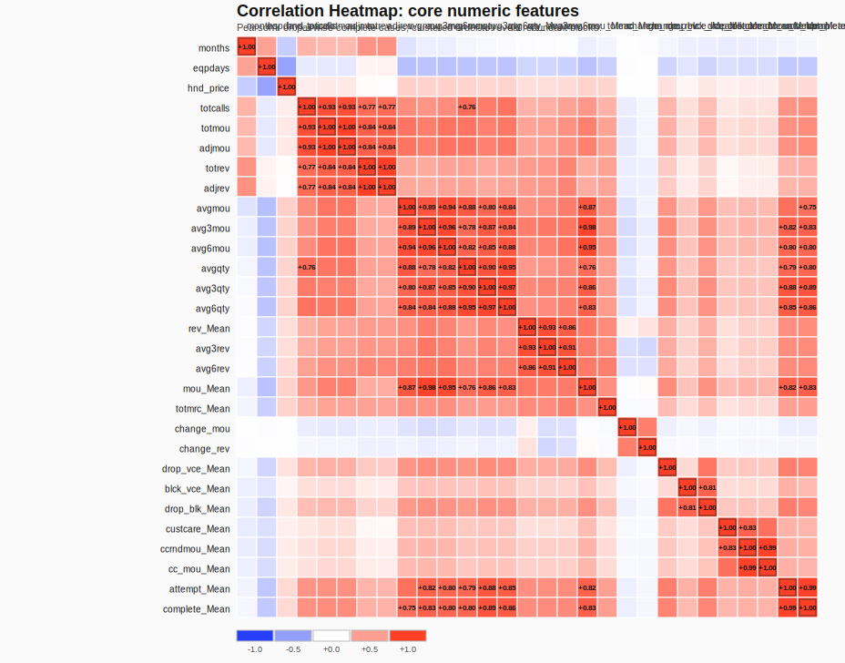
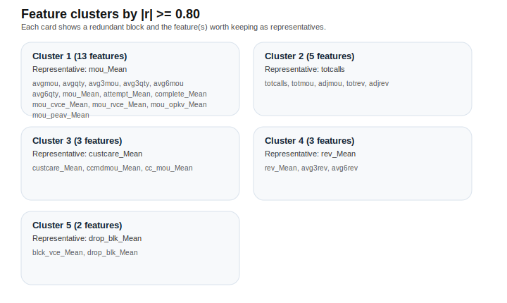
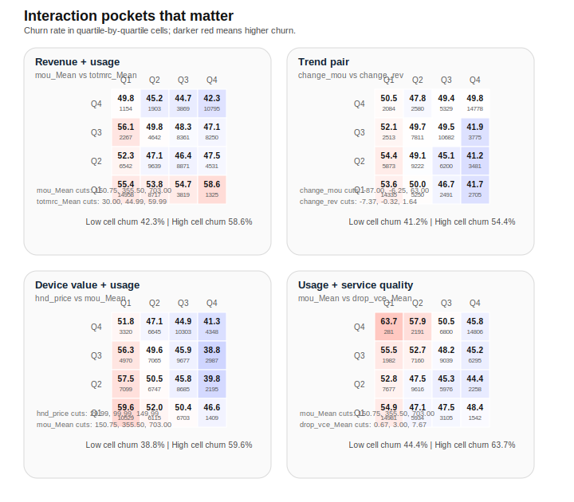

# Multivariate EDA

This section checks whether the strongest bivariate signals are genuinely distinct or just different views of the same underlying customer state. The focus is correlation structure, redundant features, interaction pockets, and the smallest useful feature set for modeling.

## Visual Summary

# Correlation Analysis

- The merged table has 100,000 customers and churn is 49.56%, so the target remains close to balanced.
- Correlations are concentrated in a few obvious blocks. The biggest risk is not missing signal, but repeated measurement of the same signal.
- The strongest positive pairs are near-duplicates or alternative time windows of the same behavior, especially usage, revenue, and customer-care metrics.
- `months` and `eqpdays` are related, but only moderately. Tenure and device age overlap, yet they are not interchangeable.
- `eqpdays` is inversely related to `hnd_price`, so older devices tend to be cheaper. `eqpdays` is also negatively related to `mou_Mean`, which fits the earlier churn story: older devices and lower engagement go together.

### Top Pairwise Correlations

| Feature A | Feature B | r | Pairs |
| --- | --- | --- | --- |
| totmou | adjmou | +1.000 | 100000 |
| totrev | adjrev | +0.998 | 100000 |
| ccrndmou_Mean | cc_mou_Mean | +0.989 | 100000 |
| attempt_Mean | complete_Mean | +0.986 | 100000 |
| avg3mou | mou_Mean | +0.981 | 99643 |
| avg3qty | avg6qty | +0.968 | 97161 |
| avg3mou | avg6mou | +0.962 | 97161 |
| avgqty | avg6qty | +0.947 | 97161 |
| avg6mou | mou_Mean | +0.945 | 96856 |
| avgmou | avg6mou | +0.941 | 97161 |

### Notable Negative Or Cross-Block Correlations

| Feature A | Feature B | r | Pairs |
| --- | --- | --- | --- |
| eqpdays | hnd_price | -0.478 | 99153 |
| eqpdays | avgmou | -0.329 | 99999 |
| eqpdays | avg6mou | -0.321 | 97160 |
| eqpdays | mou_Mean | -0.315 | 99642 |
| eqpdays | avg6qty | -0.309 | 97160 |
| eqpdays | avg3mou | -0.308 | 99999 |

### Interpretation

- The usage block is the densest structure. Many monthly and trend-based usage features are simply different slices of the same behavior state.
- Revenue follows the same pattern. Once `rev_Mean`, `avg3rev`, and `avg6rev` are present, several other revenue metrics become partially redundant.
- Customer-care metrics also cluster tightly, especially `custcare_Mean`, `ccrndmou_Mean`, and `cc_mou_Mean`.
- Service issue metrics are weaker as a single block, but voice-drop and block measures still travel together enough to warrant consolidation in modeling.

# Feature Clusters

Using a strong-correlation threshold of `|r| >= 0.80`, the data separates into compact redundant groups:

| Cluster | Representative | Size | Members |
| --- | --- | --- | --- |
| Cluster 1 | mou_Mean | 13 | avgmou, avgqty, avg3mou, avg3qty, avg6mou, avg6qty, mou_Mean, attempt_Mean, complete_Mean, mou_cvce_Mean, mou_rvce_Mean, mou_opkv_Mean, mou_peav_Mean |
| Cluster 2 | totcalls | 5 | totcalls, totmou, adjmou, totrev, adjrev |
| Cluster 3 | custcare_Mean | 3 | custcare_Mean, ccrndmou_Mean, cc_mou_Mean |
| Cluster 4 | rev_Mean | 3 | rev_Mean, avg3rev, avg6rev |
| Cluster 5 | drop_blk_Mean | 2 | blck_vce_Mean, drop_blk_Mean |

### Cluster Readout

- `Cluster 1` is the main utilization block. It mixes average usage, recent usage windows, usage composition, and the call attempt/complete metrics.
- `Cluster 2` is a compact volume-and-revenue block. `totcalls`, `totmou`, `adjmou`, `totrev`, and `adjrev` are too similar to all keep as-is.
- `Cluster 3` is the customer-care block. One proxy is enough unless the business wants to separate call volume from call duration.
- `Cluster 4` is the revenue trend block. `rev_Mean`, `avg3rev`, and `avg6rev` are strongly overlapping.
- `Cluster 5` is a service-issue pair.
- `mou_cdat_Mean` / `mou_opkd_Mean` is a separate high-correlation traffic-mix pair and should be treated as local redundancy if those fields are used.
- `months`, `eqpdays`, and `hnd_price` do not collapse into one cluster. They should be treated as related but distinct signals.

# Interaction Insights

## Revenue + usage

- Low usage plus high monthly charge is the clearest risk pocket, reaching 58.6% churn.
- High usage plus high monthly charge is safer at 42.3%.
- Quartile cuts for `mou_Mean`: 150.75, 355.50, 703.00
- Quartile cuts for `totmrc_Mean`: 30.00, 44.99, 59.99

## Recent trend pair

- The joint trend signal is directional but flatter than the raw level features. The highest-risk cell reaches 54.4% churn, while the lowest-risk cell is 41.2%.
- This means trend features help, but they should not be treated as the sole churn trigger.
- Quartile cuts for `change_mou`: -87.00, -6.25, 63.00
- Quartile cuts for `change_rev`: -7.37, -0.32, 1.64

## Device value + usage

- Low handset price combined with low usage is the riskiest pocket at 59.6% churn.
- High handset price and high usage are much safer at 38.8%.
- Quartile cuts for `hnd_price`: 29.99, 99.99, 149.99
- Quartile cuts for `mou_Mean`: 150.75, 355.50, 703.00

## Usage + service quality

- Low usage plus poor voice-drop experience is the harshest combination, reaching 63.7% churn.
- High usage with low drop counts is materially safer at 44.4%.
- Quartile cuts for `mou_Mean`: 150.75, 355.50, 703.00
- Quartile cuts for `drop_vce_Mean`: 0.67, 3.00, 7.67

## Charge + service quality

- The highest-risk cell reaches 59.8% churn and the lowest-risk cell reaches 42.7%.
- Charge and service quality matter most when they stack on top of low engagement.
- Quartile cuts for `totmrc_Mean`: 30.00, 44.99, 59.99
- Quartile cuts for `drop_vce_Mean`: 0.67, 3.00, 7.67

# Candidate Feature Engineering Ideas

- Compress the utilization block to one or two features, rather than keeping every monthly and windowed version.
- Compress the revenue block to one level feature and one trend feature, rather than all three rolling windows.
- Engineer `usage_to_charge = mou_Mean / totmrc_Mean` to normalize activity by recurring bill burden.
- Engineer `revenue_per_usage = rev_Mean / (mou_Mean + 1)` to distinguish high spend from high volume.
- Engineer `trend_gap = avg3mou - avg6mou` and `revenue_gap = avg3rev - avg6rev` to capture acceleration or decline.
- Engineer `service_issue_score = drop_vce_Mean + blck_vce_Mean + drop_blk_Mean` or a broader version including data issues, then keep the components only if the model needs interpretability.
- Engineer `support_intensity = custcare_Mean + ccrndmou_Mean + cc_mou_Mean` only if a single care proxy is preferable to three overlapping fields.
- Interaction flags worth testing first: `low_usage_x_high_charge`, `low_usage_x_poor_service`, and `old_device_x_low_value`.

# Modeling Implications

- Regularized linear models should be fine if each cluster is reduced to a small representative set.
- Tree-based models can ingest more raw columns, but duplicate measures still make importance rankings noisy and harder to explain.
- A first-pass feature shortlist should include `change_mou`, `change_rev`, `eqpdays`, `hnd_price`, `mou_Mean`, `totmrc_Mean`, `drop_vce_Mean`, and `custcare_Mean`.
- The service metrics are better treated as amplifiers than as primary churn drivers.
- The dominant modeling story is additive stacking: low engagement, high bill burden, old equipment, and service trouble together make the strongest churn pocket.

# Key Takeaways

- The data contains strong multicollinearity, but it is structured and understandable.
- Usage and revenue are the biggest redundancy risk; care metrics are the second.
- Device age and handset value matter, but they are weaker than the activity block.
- The best model will probably come from a compact feature set plus a few explicit interaction terms, not from raw breadth.
