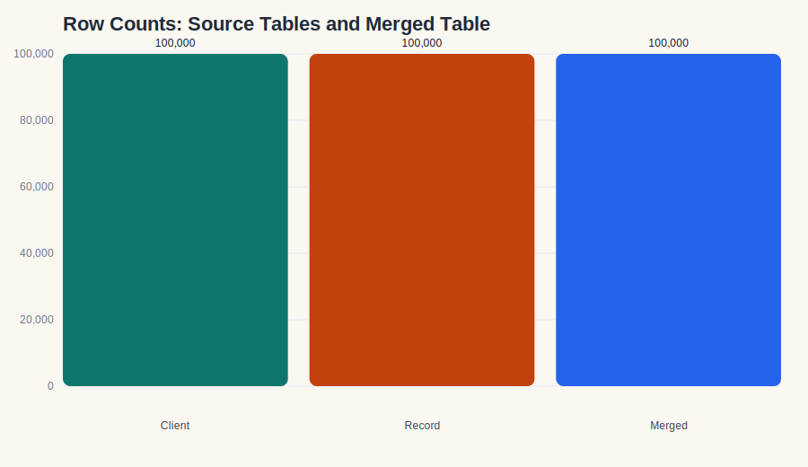
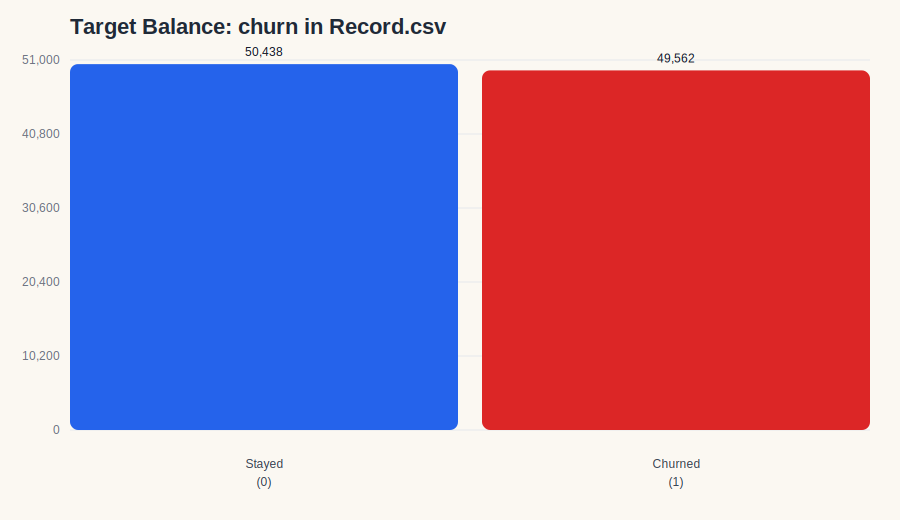
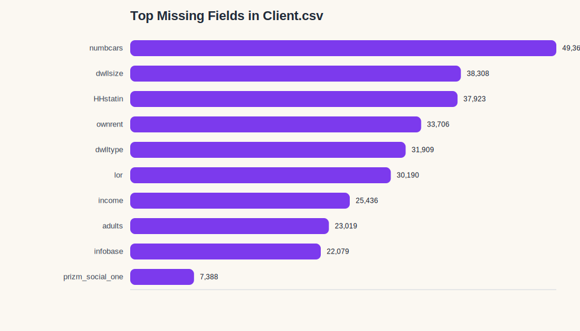
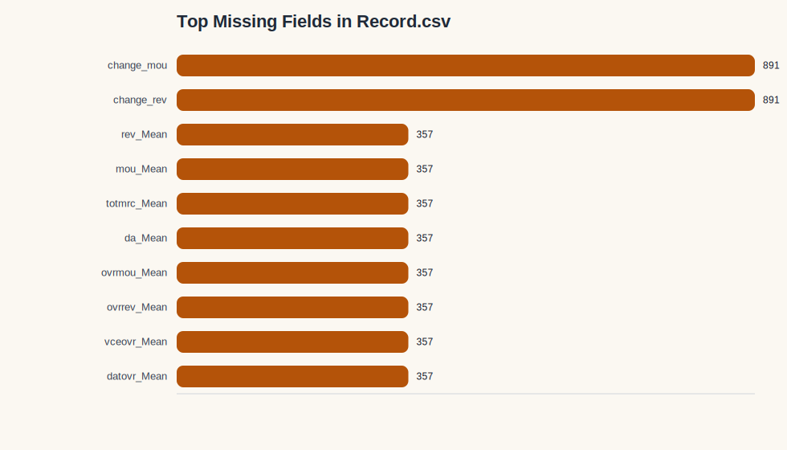

# Dataset Shape

The telecom data is split across two one-to-one customer-level source tables joined by `Customer_ID`.

| Table | Rows | Columns | Role |
|---|---:|---:|---|
| `Client.csv` | 100,000 | 50 | Customer profile, household, device, and subscription context |
| `Record.csv` | 100,000 | 51 | Usage, billing, service-quality, timing, and target fields |
| Merged analytical table | 100,000 | 100 | Combined working table for EDA and modeling |

Key shape takeaways:

- Both source files have the same row count, which is a strong sign they were designed to join cleanly.
- The merged table keeps all customer rows and removes only the duplicate join key.
- `Record.csv` is the primary analytical table because it contains `churn`.

# Merge Validation

The merge was validated as a clean one-to-one inner join on `Customer_ID`.

| Check | Result |
|---|---|
| Shared join key | `Customer_ID` |
| `Customer_ID` overlap across files | 100,000 / 100,000 customers |
| Inner-join row count | 100,000 |
| Merged column count | 100 |
| Shared non-key columns | None |
| Target availability | `churn` is present in `Record.csv` and available after merge |

Target balance in the analytical table:

| Churn class | Count | Share |
|---|---:|---:|
| `0` | 50,438 | 50.44% |
| `1` | 49,562 | 49.56% |

# Duplicate Analysis

| Table | Duplicate `Customer_ID` rows | Interpretation |
|---|---:|---|
| `Client.csv` | 0 | Every customer appears once |
| `Record.csv` | 0 | Every customer appears once |
| Merged table | 0 | The join does not introduce duplicate customers |

This confirms the data is structurally consistent for customer-level EDA and classification.

# Data Type Summary

The raw CSVs are text-heavy, so the main task is semantic typing rather than file-format typing.

| Type family | Examples | EDA handling |
|---|---|---|
| Numeric-like fields stored as text | `totcalls`, `totmou`, `totrev`, `rev_Mean`, `mou_Mean`, `months`, `eqpdays` | Convert to numeric before aggregation, plotting, or modeling |
| Binary / flag fields | `new_cell`, `asl_flag`, `dualband`, `refurb_new`, `hnd_webcap`, `creditcd`, `forgntvl`, `churn` | Recode explicitly to documented binary values |
| Categorical codes | `crclscod`, `prizm_social_one`, `area`, `ownrent`, `dwlltype`, `marital`, `HHstatin`, `dwllsize`, `ethnic` | Keep categorical; use one-hot or encoded representations later |
| Identifier field | `Customer_ID` | Keep as a string key only; never treat as predictive |

Important handling notes:

- Numeric conversion is required before any summary statistics or correlation analysis.
- `Customer_ID` must stay out of the feature set.
- `churn` must remain the target only.
- Ambiguous fields such as `infobase` and `hnd_webcap` should be checked carefully before any forced recoding.

# Feature Group Summary

The full merged table contains 97 candidate feature columns, plus `Customer_ID`, `months`, and `churn`.

| Feature group | Count | Representative fields |
|---|---:|---|
| Identity and join field | 1 | `Customer_ID` |
| Core target and timing | 2 | `churn`, `months` |
| Client account and device context | 12 | `uniqsubs`, `actvsubs`, `new_cell`, `asl_flag`, `dualband`, `refurb_new`, `hnd_webcap`, `creditcd`, `hnd_price`, `phones`, `models`, `eqpdays` |
| Client usage and lifetime revenue | 15 | `totcalls`, `totmou`, `totrev`, `adjrev`, `adjmou`, `adjqty`, `avgrev`, `avgmou`, `avgqty`, `avg3mou`, `avg3qty`, `avg3rev`, `avg6mou`, `avg6qty`, `avg6rev` |
| Client household and demographic context | 22 | `crclscod`, `prizm_social_one`, `area`, `truck`, `rv`, `ownrent`, `lor`, `dwlltype`, `marital`, `adults`, `infobase`, `income`, `numbcars`, `HHstatin`, `dwllsize`, `forgntvl`, `ethnic`, `kid0_2`, `kid3_5`, `kid6_10`, `kid11_15`, `kid16_17` |
| Record billing and revenue behavior | 11 | `rev_Mean`, `mou_Mean`, `totmrc_Mean`, `da_Mean`, `ovrmou_Mean`, `ovrrev_Mean`, `vceovr_Mean`, `datovr_Mean`, `roam_Mean`, `change_mou`, `change_rev` |
| Record service quality and care | 12 | `drop_vce_Mean`, `drop_dat_Mean`, `blck_vce_Mean`, `blck_dat_Mean`, `unan_vce_Mean`, `unan_dat_Mean`, `custcare_Mean`, `ccrndmou_Mean`, `cc_mou_Mean`, `drop_blk_Mean`, `callwait_Mean`, `callfwdv_Mean` |
| Record call and traffic mix | 25 | `plcd_vce_Mean`, `plcd_dat_Mean`, `recv_vce_Mean`, `recv_sms_Mean`, `comp_vce_Mean`, `comp_dat_Mean`, `inonemin_Mean`, `threeway_Mean`, `mou_cvce_Mean`, `mou_cdat_Mean`, `mou_rvce_Mean`, `owylis_vce_Mean`, `mouowylisv_Mean`, `iwylis_vce_Mean`, `mouiwylisv_Mean`, `peak_vce_Mean`, `peak_dat_Mean`, `mou_peav_Mean`, `mou_pead_Mean`, `opk_vce_Mean`, `opk_dat_Mean`, `mou_opkv_Mean`, `mou_opkd_Mean`, `attempt_Mean`, `complete_Mean` |

# Initial Observations

- The merge structure is clean: one customer key, no duplicate IDs, and no row loss after the inner join.
- The target is close to perfectly balanced, which supports a standard classification baseline and makes accuracy a reasonable starting metric.
- `Client.csv` carries the main missingness burden, especially in household and demographic fields.
- `Record.csv` has very low missingness, concentrated in a small number of recent-history and trend fields.
- The most likely high-signal groups for churn analysis are recent behavior, revenue change, service quality, and handset age.
- Household and demographic features may help segmentation, but they are unlikely to dominate the churn story on their own.
- `months` should be treated as a timing feature and checked carefully against leakage assumptions before modeling.
- The overall table is well suited for downstream univariate, bivariate, and multivariate EDA once type conversion is completed.

## Supporting Charts

## Summary

This overview confirms that the dataset is structurally ready for EDA:

- both source files are complete at the row level,
- the join is one-to-one,
- the target is available and balanced,
- and the key work ahead is type cleaning, missing-value handling, and leakage-aware feature review.
