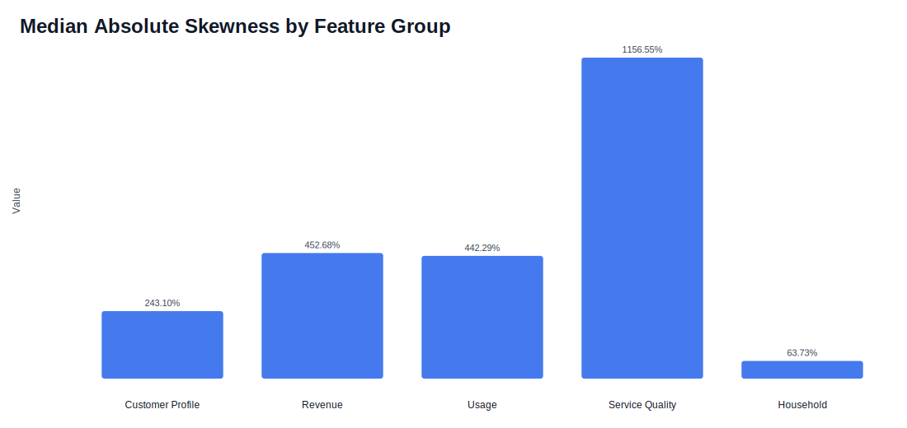
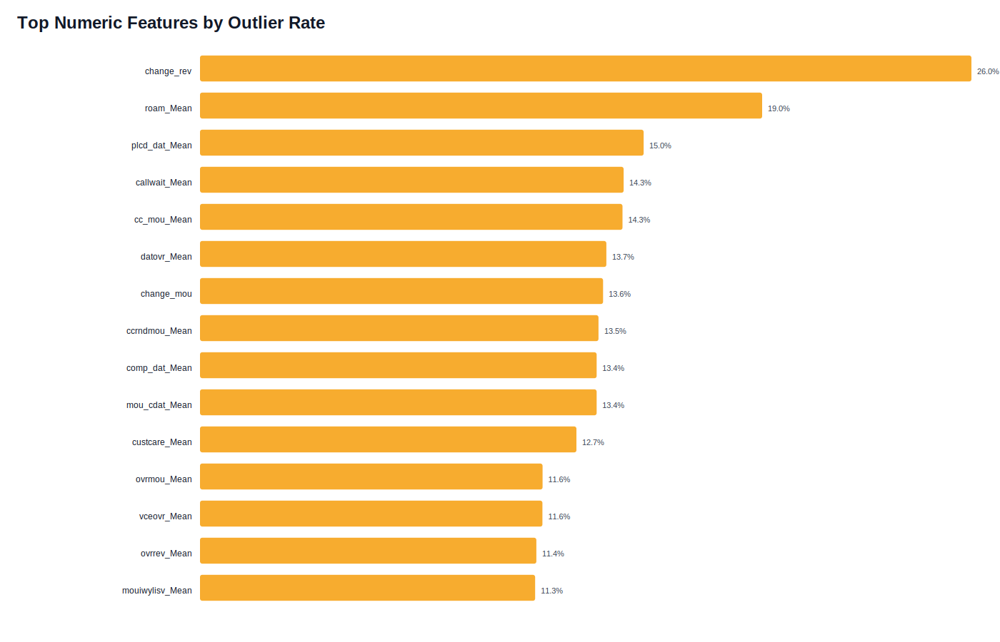
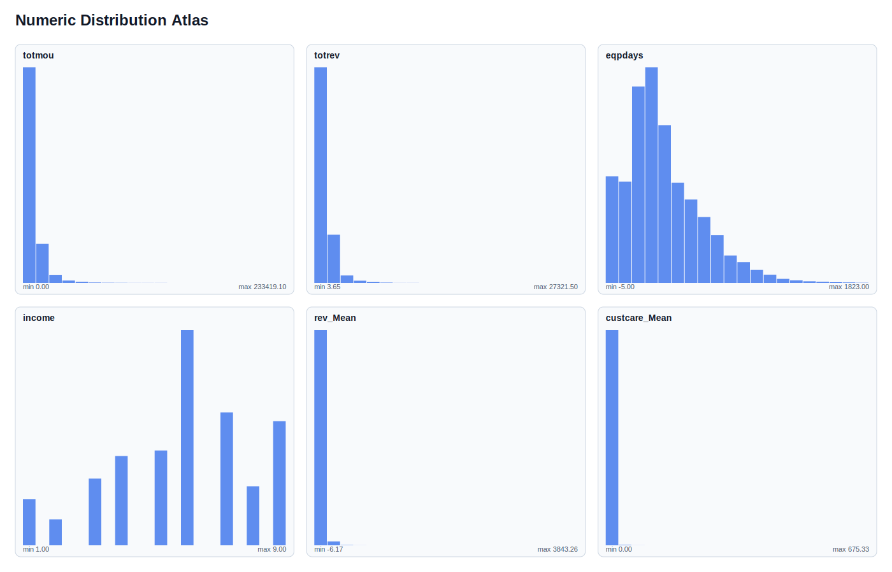
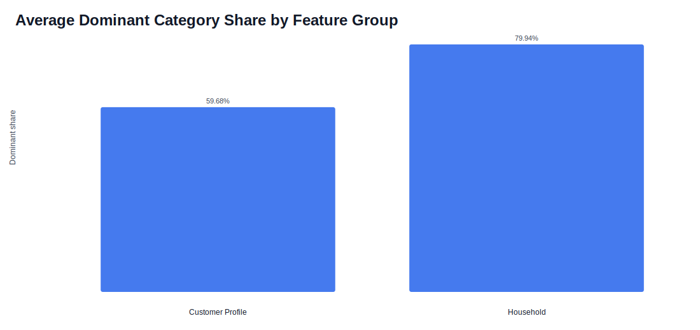
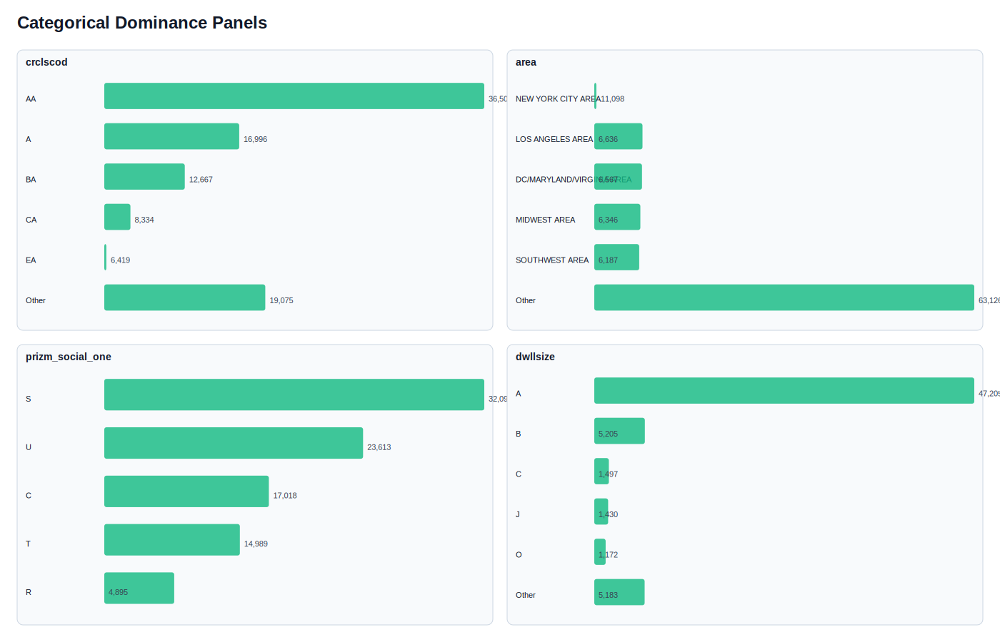

# Univariate EDA

This report analyzes the dataset one field at a time after excluding `Customer_ID` and treating `churn` as the target rather than a predictor. Numeric fields are evaluated for distribution shape, skewness, outliers, and extreme values. Categorical and boolean fields are evaluated for frequency concentration, rare levels, and dominant categories.

## Dataset Baseline

| Table | Rows | Numeric Features | Categorical Features | Target balance |
|---|---:|---:|---:|---:|
| `Client.csv` | 100,000 | 25 | 24 | N/A |
| `Record.csv` | 100,000 | 47 | 0 | `0`: 50.44%, `1`: 49.56% |

- `churn` is nearly balanced at `50.44%` vs `49.56%`, so class imbalance is not a major obstacle for later modeling.
- The main analytical work here is shape inspection, because the raw files store many numeric fields as text and several categorical codes are compact or sparse.

# Numeric Feature Analysis

## Group Overview

| Group | Numeric fields | Avg missing | Median absolute skew | Avg outlier rate |
|---|---|---|---|---|
| Customer Profile | 7 | 0.12% | 2.43 | 3.22% |
| Revenue | 11 | 0.50% | 4.53 | 8.97% |
| Usage | 38 | 0.21% | 4.42 | 8.05% |
| Service Quality | 12 | 0.00% | 11.57 | 7.87% |
| Household | 4 | 32.00% | 0.64 | 0.00% |

### Distribution Notes

| Feature | Source | N | Missing | Mean | Median | Skew | Outliers | Extremes | Note |
|---|---|---|---|---|---|---|---|---|---|
| `actvsubs` | Client.csv | 100,000 | 0.00% | 1.36 | 1.00 | 6.87 | 1.20% | 0.04% | strong skew, extreme tail |
| `adjmou` | Client.csv | 100,000 | 0.00% | 7,546.31 | 5,102.50 | 4.42 | 5.98% | 2.02% | strong skew, outlier-heavy, extreme tail |
| `adjqty` | Client.csv | 100,000 | 0.00% | 2,836.37 | 1,789.00 | 6.05 | 7.11% | 2.81% | strong skew, outlier-heavy, extreme tail |
| `adjrev` | Client.csv | 100,000 | 0.00% | 960.11 | 737.76 | 3.83 | 5.65% | 1.98% | strong skew, outlier-heavy, extreme tail |
| `adults` | Client.csv | 76,981 | 23.02% | 2.53 | 2.00 | 0.85 | 0.00% | 0.00% | high missingness, moderate skew |
| `attempt_Mean` | Record.csv | 100,000 | 0.00% | 145.75 | 101.00 | 2.64 | 5.08% | 1.37% | strong skew, outlier-heavy, extreme tail |
| `avg3mou` | Client.csv | 100,000 | 0.00% | 519.64 | 358.00 | 2.23 | 5.20% | 1.16% | strong skew, outlier-heavy, extreme tail |
| `avg3qty` | Client.csv | 100,000 | 0.00% | 180.34 | 125.00 | 3.07 | 5.38% | 1.56% | strong skew, outlier-heavy, extreme tail |
| `avg3rev` | Client.csv | 100,000 | 0.00% | 59.19 | 48.00 | 4.53 | 6.16% | 2.23% | strong skew, outlier-heavy, extreme tail |
| `avg6mou` | Client.csv | 97,161 | 2.84% | 509.63 | 363.00 | 2.09 | 4.89% | 0.99% | strong skew, extreme tail |
| `avg6qty` | Client.csv | 97,161 | 2.84% | 178.37 | 127.00 | 2.96 | 5.28% | 1.46% | strong skew, outlier-heavy, extreme tail |
| `avg6rev` | Client.csv | 97,161 | 2.84% | 58.68 | 50.00 | 3.49 | 5.39% | 1.72% | strong skew, outlier-heavy, extreme tail |
| `avgmou` | Client.csv | 100,000 | 0.00% | 483.73 | 360.19 | 2.02 | 4.71% | 0.87% | strong skew, extreme tail |
| `avgqty` | Client.csv | 100,000 | 0.00% | 173.55 | 127.50 | 2.90 | 5.25% | 1.45% | strong skew, outlier-heavy, extreme tail |
| `avgrev` | Client.csv | 100,000 | 0.00% | 57.91 | 49.89 | 3.21 | 5.31% | 1.51% | strong skew, outlier-heavy, extreme tail |
| `blck_dat_Mean` | Record.csv | 100,000 | 0.00% | 0.03 | 0.00 | 224.59 | 1.23% | 1.23% | strong skew, extreme tail |
| `blck_vce_Mean` | Record.csv | 100,000 | 0.00% | 4.02 | 1.00 | 9.73 | 10.70% | 6.20% | strong skew, outlier-heavy, extreme tail |
| `callfwdv_Mean` | Record.csv | 100,000 | 0.00% | 0.01 | 0.00 | 90.74 | 0.43% | 0.43% | strong skew, extreme tail |
| `callwait_Mean` | Record.csv | 100,000 | 0.00% | 1.78 | 0.33 | 11.14 | 14.31% | 8.91% | strong skew, outlier-heavy, extreme tail |
| `cc_mou_Mean` | Record.csv | 100,000 | 0.00% | 3.68 | 0.00 | 10.57 | 14.27% | 9.25% | strong skew, outlier-heavy, extreme tail |
| `ccrndmou_Mean` | Record.csv | 100,000 | 0.00% | 4.67 | 0.00 | 11.57 | 13.46% | 8.30% | strong skew, outlier-heavy, extreme tail |
| `change_mou` | Record.csv | 99,109 | 0.89% | -13.93 | -6.25 | 14.39 | 13.61% | 5.23% | strong skew, outlier-heavy, extreme tail |
| `change_rev` | Record.csv | 99,109 | 0.89% | -1.02 | -0.32 | 80.53 | 26.05% | 16.44% | strong skew, outlier-heavy, extreme tail |
| `comp_dat_Mean` | Record.csv | 100,000 | 0.00% | 0.77 | 0.00 | 28.64 | 13.39% | 13.39% | strong skew, outlier-heavy, extreme tail |
| `comp_vce_Mean` | Record.csv | 100,000 | 0.00% | 108.89 | 75.67 | 2.63 | 4.98% | 1.32% | strong skew, extreme tail |
| `complete_Mean` | Record.csv | 100,000 | 0.00% | 109.67 | 76.00 | 2.62 | 5.00% | 1.32% | strong skew, outlier-heavy, extreme tail |
| `custcare_Mean` | Record.csv | 100,000 | 0.00% | 1.79 | 0.00 | 32.03 | 12.71% | 7.46% | strong skew, outlier-heavy, extreme tail |
| `da_Mean` | Record.csv | 99,643 | 0.36% | 0.89 | 0.25 | 10.81 | 10.71% | 5.17% | strong skew, outlier-heavy, extreme tail |
| `datovr_Mean` | Record.csv | 99,643 | 0.36% | 0.26 | 0.00 | 58.01 | 13.72% | 13.72% | strong skew, outlier-heavy, extreme tail |
| `drop_blk_Mean` | Record.csv | 100,000 | 0.00% | 10.04 | 5.33 | 5.73 | 7.61% | 3.06% | strong skew, outlier-heavy, extreme tail |
| `drop_dat_Mean` | Record.csv | 100,000 | 0.00% | 0.04 | 0.00 | 149.64 | 2.60% | 2.60% | strong skew, extreme tail |
| `drop_vce_Mean` | Record.csv | 100,000 | 0.00% | 5.96 | 3.00 | 4.61 | 7.14% | 2.73% | strong skew, outlier-heavy, extreme tail |
| `eqpdays` | Client.csv | 99,999 | 0.00% | 391.93 | 342.00 | 1.04 | 2.59% | 0.15% | strong skew, extreme tail |
| `hnd_price` | Client.csv | 99,153 | 0.85% | 101.88 | 99.99 | 0.48 | 0.26% | 0.00% | stable shape |
| `income` | Client.csv | 74,564 | 25.44% | 5.78 | 6.00 | -0.39 | 0.00% | 0.00% | high missingness |
| `inonemin_Mean` | Record.csv | 100,000 | 0.00% | 29.77 | 12.33 | 8.91 | 8.15% | 3.51% | strong skew, outlier-heavy, extreme tail |
| `lor` | Client.csv | 69,810 | 30.19% | 6.18 | 5.00 | 0.63 | 0.00% | 0.00% | high missingness, moderate skew |
| `models` | Client.csv | 99,999 | 0.00% | 1.55 | 1.00 | 2.43 | 3.86% | 0.54% | strong skew, extreme tail |
| `months` | Record.csv | 100,000 | 0.00% | 18.83 | 16.00 | 1.06 | 2.29% | 0.00% | strong skew |
| `mou_Mean` | Record.csv | 99,643 | 0.36% | 513.56 | 355.50 | 2.31 | 5.17% | 1.12% | strong skew, outlier-heavy, extreme tail |
| `mou_cdat_Mean` | Record.csv | 100,000 | 0.00% | 1.84 | 0.00 | 49.33 | 13.39% | 13.39% | strong skew, outlier-heavy, extreme tail |
| `mou_cvce_Mean` | Record.csv | 100,000 | 0.00% | 227.76 | 146.20 | 2.56 | 5.82% | 1.54% | strong skew, outlier-heavy, extreme tail |
| `mou_opkd_Mean` | Record.csv | 100,000 | 0.00% | 1.14 | 0.00 | 67.43 | 9.62% | 9.62% | strong skew, outlier-heavy, extreme tail |
| `mou_opkv_Mean` | Record.csv | 100,000 | 0.00% | 165.28 | 75.84 | 2.90 | 8.30% | 3.10% | strong skew, outlier-heavy, extreme tail |
| `mou_pead_Mean` | Record.csv | 100,000 | 0.00% | 0.71 | 0.00 | 43.00 | 8.94% | 8.94% | strong skew, outlier-heavy, extreme tail |
| `mou_peav_Mean` | Record.csv | 100,000 | 0.00% | 174.08 | 115.37 | 3.06 | 5.87% | 1.81% | strong skew, outlier-heavy, extreme tail |
| `mou_rvce_Mean` | Record.csv | 100,000 | 0.00% | 111.65 | 50.20 | 3.09 | 7.20% | 2.40% | strong skew, outlier-heavy, extreme tail |
| `mouiwylisv_Mean` | Record.csv | 100,000 | 0.00% | 18.19 | 3.21 | 6.68 | 11.32% | 6.16% | strong skew, outlier-heavy, extreme tail |
| `mouowylisv_Mean` | Record.csv | 100,000 | 0.00% | 28.47 | 11.98 | 5.53 | 8.38% | 3.71% | strong skew, outlier-heavy, extreme tail |
| `numbcars` | Client.csv | 50,634 | 49.37% | 1.57 | 1.00 | 0.64 | 0.00% | 0.00% | high missingness, moderate skew |
| `opk_dat_Mean` | Record.csv | 100,000 | 0.00% | 0.42 | 0.00 | 29.97 | 9.61% | 9.61% | strong skew, outlier-heavy, extreme tail |
| `opk_vce_Mean` | Record.csv | 100,000 | 0.00% | 66.00 | 34.33 | 3.56 | 7.14% | 2.47% | strong skew, outlier-heavy, extreme tail |
| `ovrmou_Mean` | Record.csv | 99,643 | 0.36% | 41.07 | 2.75 | 7.42 | 11.57% | 6.34% | strong skew, outlier-heavy, extreme tail |
| `ovrrev_Mean` | Record.csv | 99,643 | 0.36% | 13.56 | 1.00 | 6.22 | 11.36% | 6.06% | strong skew, outlier-heavy, extreme tail |
| `owylis_vce_Mean` | Record.csv | 100,000 | 0.00% | 24.75 | 13.00 | 3.43 | 6.66% | 2.13% | strong skew, outlier-heavy, extreme tail |
| `peak_dat_Mean` | Record.csv | 100,000 | 0.00% | 0.36 | 0.00 | 29.81 | 8.94% | 8.94% | strong skew, outlier-heavy, extreme tail |
| `peak_vce_Mean` | Record.csv | 100,000 | 0.00% | 88.48 | 60.33 | 3.22 | 5.47% | 1.73% | strong skew, outlier-heavy, extreme tail |
| `phones` | Client.csv | 99,999 | 0.00% | 1.79 | 1.00 | 3.28 | 8.41% | 2.16% | strong skew, outlier-heavy, extreme tail |
| `plcd_dat_Mean` | Record.csv | 100,000 | 0.00% | 0.87 | 0.00 | 30.27 | 14.98% | 14.98% | strong skew, outlier-heavy, extreme tail |
| `plcd_vce_Mean` | Record.csv | 100,000 | 0.00% | 144.88 | 100.33 | 2.65 | 5.06% | 1.36% | strong skew, outlier-heavy, extreme tail |
| `recv_vce_Mean` | Record.csv | 100,000 | 0.00% | 55.09 | 26.67 | 5.63 | 7.00% | 2.58% | strong skew, outlier-heavy, extreme tail |
| `rev_Mean` | Record.csv | 99,643 | 0.36% | 58.72 | 48.20 | 9.15 | 6.00% | 2.05% | strong skew, outlier-heavy, extreme tail |
| `roam_Mean` | Record.csv | 99,643 | 0.36% | 1.29 | 0.00 | 168.80 | 18.98% | 15.68% | strong skew, outlier-heavy, extreme tail |
| `threeway_Mean` | Record.csv | 100,000 | 0.00% | 0.28 | 0.00 | 17.00 | 8.66% | 6.04% | strong skew, outlier-heavy, extreme tail |
| `totcalls` | Client.csv | 100,000 | 0.00% | 2,877.14 | 1,822.00 | 6.02 | 7.11% | 2.81% | strong skew, outlier-heavy, extreme tail |
| `totmou` | Client.csv | 100,000 | 0.00% | 7,648.36 | 5,191.50 | 4.40 | 5.99% | 2.03% | strong skew, outlier-heavy, extreme tail |
| `totmrc_Mean` | Record.csv | 99,643 | 0.36% | 46.18 | 44.99 | 1.64 | 1.81% | 0.55% | strong skew, extreme tail |
| `totrev` | Client.csv | 100,000 | 0.00% | 1,031.92 | 804.53 | 3.82 | 5.68% | 1.99% | strong skew, outlier-heavy, extreme tail |
| `unan_dat_Mean` | Record.csv | 100,000 | 0.00% | 0.03 | 0.00 | 81.81 | 3.12% | 3.12% | strong skew, extreme tail |
| `unan_vce_Mean` | Record.csv | 100,000 | 0.00% | 27.78 | 16.00 | 4.24 | 6.86% | 2.47% | strong skew, outlier-heavy, extreme tail |
| `uniqsubs` | Client.csv | 100,000 | 0.00% | 1.55 | 1.00 | 60.52 | 3.90% | 0.51% | strong skew, extreme tail |
| `vceovr_Mean` | Record.csv | 99,643 | 0.36% | 13.30 | 0.68 | 6.01 | 11.56% | 6.24% | strong skew, outlier-heavy, extreme tail |

### Customer Profile

| Feature | N | Missing | Mean | Median | Std | Q1 | Q3 | Min | Max | Skew | Outliers | Assessment |
|---|---|---|---|---|---|---|---|---|---|---|---|---|
| `months` | 100,000 | 0.00% | 18.83 | 16.00 | 9.66 | 11.00 | 24.00 | 6.00 | 61.00 | 1.06 | 2.29% | strong skew |
| `actvsubs` | 100,000 | 0.00% | 1.36 | 1.00 | 0.66 | 1.00 | 2.00 | 0.00 | 53.00 | 6.87 | 1.20% | strong skew, extreme tail |
| `uniqsubs` | 100,000 | 0.00% | 1.55 | 1.00 | 1.08 | 1.00 | 2.00 | 1.00 | 196.00 | 60.52 | 3.90% | strong skew, extreme tail |
| `phones` | 99,999 | 0.00% | 1.79 | 1.00 | 1.31 | 1.00 | 2.00 | 1.00 | 28.00 | 3.28 | 8.41% | strong skew, outlier-heavy, extreme tail |
| `models` | 99,999 | 0.00% | 1.55 | 1.00 | 0.90 | 1.00 | 2.00 | 1.00 | 16.00 | 2.43 | 3.86% | strong skew, extreme tail |
| `eqpdays` | 99,999 | 0.00% | 391.93 | 342.00 | 256.48 | 212.00 | 530.00 | -5.00 | 1,823.00 | 1.04 | 2.59% | strong skew, extreme tail |
| `hnd_price` | 99,153 | 0.85% | 101.88 | 99.99 | 61.01 | 29.99 | 149.99 | 9.99 | 499.99 | 0.48 | 0.26% | stable shape |

### Revenue

| Feature | N | Missing | Mean | Median | Std | Q1 | Q3 | Min | Max | Skew | Outliers | Assessment |
|---|---|---|---|---|---|---|---|---|---|---|---|---|
| `totrev` | 100,000 | 0.00% | 1,031.92 | 804.53 | 852.91 | 518.98 | 1,263.77 | 3.65 | 27,321.50 | 3.82 | 5.68% | strong skew, outlier-heavy, extreme tail |
| `adjrev` | 100,000 | 0.00% | 960.11 | 737.76 | 840.17 | 452.18 | 1,188.18 | 2.40 | 27,071.30 | 3.83 | 5.65% | strong skew, outlier-heavy, extreme tail |
| `avgrev` | 100,000 | 0.00% | 57.91 | 49.89 | 36.16 | 35.37 | 69.48 | 0.48 | 924.27 | 3.21 | 5.31% | strong skew, outlier-heavy, extreme tail |
| `avg3rev` | 100,000 | 0.00% | 59.19 | 48.00 | 46.70 | 33.00 | 71.00 | 1.00 | 1,593.00 | 4.53 | 6.16% | strong skew, outlier-heavy, extreme tail |
| `avg6rev` | 97,161 | 2.84% | 58.68 | 50.00 | 40.76 | 34.00 | 71.00 | -2.00 | 866.00 | 3.49 | 5.39% | strong skew, outlier-heavy, extreme tail |
| `rev_Mean` | 99,643 | 0.36% | 58.72 | 48.20 | 46.29 | 33.26 | 70.75 | -6.17 | 3,843.26 | 9.15 | 6.00% | strong skew, outlier-heavy, extreme tail |
| `totmrc_Mean` | 99,643 | 0.36% | 46.18 | 44.99 | 23.62 | 30.00 | 59.99 | -26.91 | 409.99 | 1.64 | 1.81% | strong skew, extreme tail |
| `ovrrev_Mean` | 99,643 | 0.36% | 13.56 | 1.00 | 30.50 | 0.00 | 14.44 | 0.00 | 1,102.40 | 6.22 | 11.36% | strong skew, outlier-heavy, extreme tail |
| `datovr_Mean` | 99,643 | 0.36% | 0.26 | 0.00 | 3.13 | 0.00 | 0.00 | 0.00 | 423.54 | 58.01 | 13.72% | strong skew, outlier-heavy, extreme tail |
| `vceovr_Mean` | 99,643 | 0.36% | 13.30 | 0.68 | 30.06 | 0.00 | 14.03 | 0.00 | 896.09 | 6.01 | 11.56% | strong skew, outlier-heavy, extreme tail |
| `change_rev` | 99,109 | 0.89% | -1.02 | -0.32 | 50.36 | -7.37 | 1.64 | -1,107.74 | 9,963.66 | 80.53 | 26.05% | strong skew, outlier-heavy, extreme tail |

### Usage

| Feature | N | Missing | Mean | Median | Std | Q1 | Q3 | Min | Max | Skew | Outliers | Assessment |
|---|---|---|---|---|---|---|---|---|---|---|---|---|
| `totcalls` | 100,000 | 0.00% | 2,877.14 | 1,822.00 | 3,790.86 | 889.00 | 3,492.00 | 0.00 | 98,874.00 | 6.02 | 7.11% | strong skew, outlier-heavy, extreme tail |
| `totmou` | 100,000 | 0.00% | 7,648.36 | 5,191.50 | 8,666.56 | 2,529.00 | 9,776.00 | 0.00 | 233,419.10 | 4.40 | 5.99% | strong skew, outlier-heavy, extreme tail |
| `adjmou` | 100,000 | 0.00% | 7,546.31 | 5,102.50 | 8,594.89 | 2,474.00 | 9,661.00 | 0.00 | 232,855.10 | 4.42 | 5.98% | strong skew, outlier-heavy, extreme tail |
| `adjqty` | 100,000 | 0.00% | 2,836.37 | 1,789.00 | 3,756.51 | 868.00 | 3,442.00 | 0.00 | 98,705.00 | 6.05 | 7.11% | strong skew, outlier-heavy, extreme tail |
| `avgmou` | 100,000 | 0.00% | 483.73 | 360.19 | 438.49 | 176.14 | 655.67 | 0.00 | 7,040.13 | 2.02 | 4.71% | strong skew, extreme tail |
| `avgqty` | 100,000 | 0.00% | 173.55 | 127.50 | 167.82 | 64.09 | 228.57 | 0.00 | 3,017.11 | 2.90 | 5.25% | strong skew, outlier-heavy, extreme tail |
| `avg3mou` | 100,000 | 0.00% | 519.64 | 358.00 | 533.63 | 152.00 | 711.00 | 0.00 | 7,716.00 | 2.23 | 5.20% | strong skew, outlier-heavy, extreme tail |
| `avg3qty` | 100,000 | 0.00% | 180.34 | 125.00 | 192.73 | 55.00 | 240.00 | 0.00 | 3,909.00 | 3.07 | 5.38% | strong skew, outlier-heavy, extreme tail |
| `avg6mou` | 97,161 | 2.84% | 509.63 | 363.00 | 496.66 | 163.00 | 698.00 | 0.00 | 7,217.00 | 2.09 | 4.89% | strong skew, extreme tail |
| `avg6qty` | 97,161 | 2.84% | 178.37 | 127.00 | 182.72 | 59.00 | 237.00 | 0.00 | 3,256.00 | 2.96 | 5.28% | strong skew, outlier-heavy, extreme tail |
| `mou_Mean` | 99,643 | 0.36% | 513.56 | 355.50 | 525.17 | 150.75 | 703.00 | 0.00 | 12,206.75 | 2.31 | 5.17% | strong skew, outlier-heavy, extreme tail |
| `change_mou` | 99,109 | 0.89% | -13.93 | -6.25 | 276.09 | -87.00 | 63.00 | -3,875.00 | 31,219.25 | 14.39 | 13.61% | strong skew, outlier-heavy, extreme tail |
| `da_Mean` | 99,643 | 0.36% | 0.89 | 0.25 | 2.18 | 0.00 | 0.99 | 0.00 | 159.39 | 10.81 | 10.71% | strong skew, outlier-heavy, extreme tail |
| `ovrmou_Mean` | 99,643 | 0.36% | 41.07 | 2.75 | 97.30 | 0.00 | 42.00 | 0.00 | 4,320.75 | 7.42 | 11.57% | strong skew, outlier-heavy, extreme tail |
| `roam_Mean` | 99,643 | 0.36% | 1.29 | 0.00 | 14.71 | 0.00 | 0.23 | 0.00 | 3,685.20 | 168.80 | 18.98% | strong skew, outlier-heavy, extreme tail |
| `plcd_vce_Mean` | 100,000 | 0.00% | 144.88 | 100.33 | 158.27 | 38.33 | 198.67 | 0.00 | 2,289.00 | 2.65 | 5.06% | strong skew, outlier-heavy, extreme tail |
| `plcd_dat_Mean` | 100,000 | 0.00% | 0.87 | 0.00 | 9.05 | 0.00 | 0.00 | 0.00 | 733.67 | 30.27 | 14.98% | strong skew, outlier-heavy, extreme tail |
| `recv_vce_Mean` | 100,000 | 0.00% | 55.09 | 26.67 | 86.84 | 5.33 | 71.33 | 0.00 | 3,369.33 | 5.63 | 7.00% | strong skew, outlier-heavy, extreme tail |
| `comp_vce_Mean` | 100,000 | 0.00% | 108.89 | 75.67 | 118.58 | 28.67 | 149.67 | 0.00 | 1,894.33 | 2.63 | 4.98% | strong skew, extreme tail |
| `comp_dat_Mean` | 100,000 | 0.00% | 0.77 | 0.00 | 8.13 | 0.00 | 0.00 | 0.00 | 559.33 | 28.64 | 13.39% | strong skew, outlier-heavy, extreme tail |
| `inonemin_Mean` | 100,000 | 0.00% | 29.77 | 12.33 | 55.83 | 2.67 | 35.67 | 0.00 | 3,086.67 | 8.91 | 8.15% | strong skew, outlier-heavy, extreme tail |
| `threeway_Mean` | 100,000 | 0.00% | 0.28 | 0.00 | 1.09 | 0.00 | 0.33 | 0.00 | 66.00 | 17.00 | 8.66% | strong skew, outlier-heavy, extreme tail |
| `mou_cvce_Mean` | 100,000 | 0.00% | 227.76 | 146.20 | 264.40 | 49.05 | 309.48 | 0.00 | 4,514.45 | 2.56 | 5.82% | strong skew, outlier-heavy, extreme tail |
| `mou_cdat_Mean` | 100,000 | 0.00% | 1.84 | 0.00 | 23.73 | 0.00 | 0.00 | 0.00 | 3,032.05 | 49.33 | 13.39% | strong skew, outlier-heavy, extreme tail |
| `mou_rvce_Mean` | 100,000 | 0.00% | 111.65 | 50.20 | 162.69 | 7.65 | 149.45 | 0.00 | 3,287.25 | 3.09 | 7.20% | strong skew, outlier-heavy, extreme tail |
| `owylis_vce_Mean` | 100,000 | 0.00% | 24.75 | 13.00 | 34.41 | 3.00 | 33.00 | 0.00 | 644.33 | 3.43 | 6.66% | strong skew, outlier-heavy, extreme tail |
| `mouowylisv_Mean` | 100,000 | 0.00% | 28.47 | 11.98 | 48.96 | 2.38 | 34.17 | 0.00 | 1,802.71 | 5.53 | 8.38% | strong skew, outlier-heavy, extreme tail |
| `mouiwylisv_Mean` | 100,000 | 0.00% | 18.19 | 3.21 | 41.42 | 0.00 | 18.25 | 0.00 | 1,703.54 | 6.68 | 11.32% | strong skew, outlier-heavy, extreme tail |
| `peak_vce_Mean` | 100,000 | 0.00% | 88.48 | 60.33 | 103.07 | 21.67 | 118.67 | 0.00 | 2,090.67 | 3.22 | 5.47% | strong skew, outlier-heavy, extreme tail |
| `peak_dat_Mean` | 100,000 | 0.00% | 0.36 | 0.00 | 4.07 | 0.00 | 0.00 | 0.00 | 281.00 | 29.81 | 8.94% | strong skew, outlier-heavy, extreme tail |
| `mou_peav_Mean` | 100,000 | 0.00% | 174.08 | 115.37 | 207.67 | 37.64 | 233.22 | 0.00 | 4,015.35 | 3.06 | 5.87% | strong skew, outlier-heavy, extreme tail |
| `mou_pead_Mean` | 100,000 | 0.00% | 0.71 | 0.00 | 8.41 | 0.00 | 0.00 | 0.00 | 1,036.05 | 43.00 | 8.94% | strong skew, outlier-heavy, extreme tail |
| `opk_vce_Mean` | 100,000 | 0.00% | 66.00 | 34.33 | 91.46 | 10.33 | 86.33 | 0.00 | 1,643.33 | 3.56 | 7.14% | strong skew, outlier-heavy, extreme tail |
| `opk_dat_Mean` | 100,000 | 0.00% | 0.42 | 0.00 | 4.65 | 0.00 | 0.00 | 0.00 | 309.67 | 29.97 | 9.61% | strong skew, outlier-heavy, extreme tail |
| `mou_opkv_Mean` | 100,000 | 0.00% | 165.28 | 75.84 | 237.33 | 18.54 | 211.19 | 0.00 | 4,337.89 | 2.90 | 8.30% | strong skew, outlier-heavy, extreme tail |
| `mou_opkd_Mean` | 100,000 | 0.00% | 1.14 | 0.00 | 17.77 | 0.00 | 0.00 | 0.00 | 2,922.04 | 67.43 | 9.62% | strong skew, outlier-heavy, extreme tail |
| `attempt_Mean` | 100,000 | 0.00% | 145.75 | 101.00 | 159.35 | 38.33 | 199.67 | 0.00 | 2,289.00 | 2.64 | 5.08% | strong skew, outlier-heavy, extreme tail |
| `complete_Mean` | 100,000 | 0.00% | 109.67 | 76.00 | 119.59 | 28.67 | 150.67 | 0.00 | 1,894.33 | 2.62 | 5.00% | strong skew, outlier-heavy, extreme tail |

### Service Quality

| Feature | N | Missing | Mean | Median | Std | Q1 | Q3 | Min | Max | Skew | Outliers | Assessment |
|---|---|---|---|---|---|---|---|---|---|---|---|---|
| `drop_vce_Mean` | 100,000 | 0.00% | 5.96 | 3.00 | 8.95 | 0.67 | 7.67 | 0.00 | 232.67 | 4.61 | 7.14% | strong skew, outlier-heavy, extreme tail |
| `drop_dat_Mean` | 100,000 | 0.00% | 0.04 | 0.00 | 0.88 | 0.00 | 0.00 | 0.00 | 207.33 | 149.64 | 2.60% | strong skew, extreme tail |
| `blck_vce_Mean` | 100,000 | 0.00% | 4.02 | 1.00 | 10.67 | 0.00 | 3.67 | 0.00 | 385.33 | 9.73 | 10.70% | strong skew, outlier-heavy, extreme tail |
| `blck_dat_Mean` | 100,000 | 0.00% | 0.03 | 0.00 | 1.49 | 0.00 | 0.00 | 0.00 | 413.33 | 224.59 | 1.23% | strong skew, extreme tail |
| `drop_blk_Mean` | 100,000 | 0.00% | 10.04 | 5.33 | 15.42 | 1.67 | 12.33 | 0.00 | 489.67 | 5.73 | 7.61% | strong skew, outlier-heavy, extreme tail |
| `unan_vce_Mean` | 100,000 | 0.00% | 27.78 | 16.00 | 38.36 | 5.00 | 36.00 | 0.00 | 848.67 | 4.24 | 6.86% | strong skew, outlier-heavy, extreme tail |
| `unan_dat_Mean` | 100,000 | 0.00% | 0.03 | 0.00 | 0.50 | 0.00 | 0.00 | 0.00 | 81.67 | 81.81 | 3.12% | strong skew, extreme tail |
| `custcare_Mean` | 100,000 | 0.00% | 1.79 | 0.00 | 5.32 | 0.00 | 1.67 | 0.00 | 675.33 | 32.03 | 12.71% | strong skew, outlier-heavy, extreme tail |
| `ccrndmou_Mean` | 100,000 | 0.00% | 4.67 | 0.00 | 12.76 | 0.00 | 4.00 | 0.00 | 861.33 | 11.57 | 13.46% | strong skew, outlier-heavy, extreme tail |
| `cc_mou_Mean` | 100,000 | 0.00% | 3.68 | 0.00 | 10.54 | 0.00 | 2.87 | 0.00 | 602.95 | 10.57 | 14.27% | strong skew, outlier-heavy, extreme tail |
| `callwait_Mean` | 100,000 | 0.00% | 1.78 | 0.33 | 5.35 | 0.00 | 1.33 | 0.00 | 212.67 | 11.14 | 14.31% | strong skew, outlier-heavy, extreme tail |
| `callfwdv_Mean` | 100,000 | 0.00% | 0.01 | 0.00 | 0.55 | 0.00 | 0.00 | 0.00 | 81.33 | 90.74 | 0.43% | strong skew, extreme tail |

### Household

| Feature | N | Missing | Mean | Median | Std | Q1 | Q3 | Min | Max | Skew | Outliers | Assessment |
|---|---|---|---|---|---|---|---|---|---|---|---|---|
| `lor` | 69,810 | 30.19% | 6.18 | 5.00 | 4.74 | 2.00 | 9.00 | 0.00 | 15.00 | 0.63 | 0.00% | high missingness, moderate skew |
| `adults` | 76,981 | 23.02% | 2.53 | 2.00 | 1.45 | 1.00 | 3.00 | 1.00 | 6.00 | 0.85 | 0.00% | high missingness, moderate skew |
| `income` | 74,564 | 25.44% | 5.78 | 6.00 | 2.18 | 4.00 | 7.00 | 1.00 | 9.00 | -0.39 | 0.00% | high missingness |
| `numbcars` | 50,634 | 49.37% | 1.57 | 1.00 | 0.63 | 1.00 | 2.00 | 1.00 | 3.00 | 0.64 | 0.00% | high missingness, moderate skew |

# Categorical Feature Analysis

## Group Overview

| Group | Categorical fields | Avg missing | Avg dominant share | Avg unique levels |
|---|---|---|---|---|
| Customer Profile | 8 | 2.20% | 59.68% | 11.5 |
| Household | 16 | 11.44% | 79.94% | 4.2 |

### Frequency Notes

| Feature | Source | Levels | Missing | Dominant category | Rare levels | Rare share | Top categories | Assessment |
|---|---|---|---|---|---|---|---|---|
| `HHstatin` | Client.csv | 6 | 37.92% | C (63.0%) | 0 | 0.00% | C (63.0%); I (19.9%); A (7.5%) | concentrated |
| `area` | Client.csv | 19 | 0.04% | NEW YORK CITY AREA (11.1%) | 0 | 0.00% | NEW YORK CITY AREA (11.1%); LOS ANGELES AREA (6.6%); DC/MARYLAND/VIRGINIA AREA (6.6%) | multi-level |
| `asl_flag` | Client.csv | 2 | 0.00% | N (86.1%) | 0 | 0.00% | N (86.1%); Y (13.9%) | dominant category |
| `crclscod` | Client.csv | 54 | 0.00% | AA (36.5%) | 45 | 6.35% | AA (36.5%); A (17.0%); BA (12.7%) | multi-level, rare categories present |
| `creditcd` | Client.csv | 2 | 1.73% | Y (68.4%) | 0 | 0.00% | Y (68.4%); N (31.6%) | concentrated |
| `dualband` | Client.csv | 4 | 0.00% | Y (72.3%) | 1 | 0.22% | Y (72.3%); N (23.2%); T (4.3%) | concentrated, rare categories present |
| `dwllsize` | Client.csv | 15 | 38.31% | A (76.5%) | 7 | 4.50% | A (76.5%); B (8.4%); C (2.4%) | concentrated, multi-level, rare categories present |
| `dwlltype` | Client.csv | 2 | 31.91% | S (71.6%) | 0 | 0.00% | S (71.6%); M (28.4%) | concentrated |
| `ethnic` | Client.csv | 17 | 1.73% | N (34.0%) | 5 | 1.86% | N (34.0%); H (13.9%); S (13.0%) | multi-level, rare categories present |
| `forgntvl` | Client.csv | 2 | 1.73% | 0 (94.2%) | 0 | 0.00% | 0 (94.2%); 1 (5.8%) | dominant category |
| `hnd_webcap` | Client.csv | 3 | 10.19% | WCMB (84.3%) | 1 | 0.26% | WCMB (84.3%); WC (15.4%); UNKW (0.3%) | dominant category, rare categories present |
| `infobase` | Client.csv | 2 | 22.08% | M (99.7%) | 1 | 0.29% | M (99.7%); N (0.3%) | dominant category, rare categories present |
| `kid0_2` | Client.csv | 2 | 1.73% | U (95.9%) | 0 | 0.00% | U (95.9%); Y (4.1%) | dominant category |
| `kid11_15` | Client.csv | 2 | 1.73% | U (91.0%) | 0 | 0.00% | U (91.0%); Y (9.0%) | dominant category |
| `kid16_17` | Client.csv | 2 | 1.73% | U (89.9%) | 0 | 0.00% | U (89.9%); Y (10.1%) | dominant category |
| `kid3_5` | Client.csv | 2 | 1.73% | U (95.2%) | 0 | 0.00% | U (95.2%); Y (4.8%) | dominant category |
| `kid6_10` | Client.csv | 2 | 1.73% | U (91.8%) | 0 | 0.00% | U (91.8%); Y (8.2%) | dominant category |
| `marital` | Client.csv | 5 | 1.73% | U (38.0%) | 0 | 0.00% | U (38.0%); M (31.6%); S (17.9%) | balanced |
| `new_cell` | Client.csv | 3 | 0.00% | U (66.9%) | 0 | 0.00% | U (66.9%); Y (19.3%); N (13.8%) | concentrated |
| `ownrent` | Client.csv | 2 | 33.71% | O (97.0%) | 0 | 0.00% | O (97.0%); R (3.0%) | dominant category |
| `prizm_social_one` | Client.csv | 5 | 7.39% | S (34.7%) | 0 | 0.00% | S (34.7%); U (25.5%); C (18.4%) | balanced |
| `refurb_new` | Client.csv | 2 | 0.00% | N (85.6%) | 0 | 0.00% | N (85.6%); R (14.4%) | dominant category |
| `rv` | Client.csv | 2 | 1.73% | 0 (91.7%) | 0 | 0.00% | 0 (91.7%); 1 (8.3%) | dominant category |
| `truck` | Client.csv | 2 | 1.73% | 0 (81.1%) | 0 | 0.00% | 0 (81.1%); 1 (18.9%) | dominant category |

### Customer Profile

| Feature | N | Missing | Levels | Dominant category | Rare levels | Rare share | Top categories | Assessment |
|---|---|---|---|---|---|---|---|---|
| `new_cell` | 100,000 | 0.00% | 3 | U (66.9%) | 0 | 0.00% | U (66.9%); Y (19.3%); N (13.8%) | concentrated |
| `crclscod` | 100,000 | 0.00% | 54 | AA (36.5%) | 45 | 6.35% | AA (36.5%); A (17.0%); BA (12.7%) | multi-level, rare categories present |
| `asl_flag` | 100,000 | 0.00% | 2 | N (86.1%) | 0 | 0.00% | N (86.1%); Y (13.9%) | dominant category |
| `prizm_social_one` | 92,612 | 7.39% | 5 | S (34.7%) | 0 | 0.00% | S (34.7%); U (25.5%); C (18.4%) | balanced |
| `area` | 99,960 | 0.04% | 19 | NEW YORK CITY AREA (11.1%) | 0 | 0.00% | NEW YORK CITY AREA (11.1%); LOS ANGELES AREA (6.6%); DC/MARYLAND/VIRGINIA AREA (6.6%) | multi-level |
| `dualband` | 99,999 | 0.00% | 4 | Y (72.3%) | 1 | 0.22% | Y (72.3%); N (23.2%); T (4.3%) | concentrated, rare categories present |
| `refurb_new` | 99,999 | 0.00% | 2 | N (85.6%) | 0 | 0.00% | N (85.6%); R (14.4%) | dominant category |
| `hnd_webcap` | 89,811 | 10.19% | 3 | WCMB (84.3%) | 1 | 0.26% | WCMB (84.3%); WC (15.4%); UNKW (0.3%) | dominant category, rare categories present |

### Household

| Feature | N | Missing | Levels | Dominant category | Rare levels | Rare share | Top categories | Assessment |
|---|---|---|---|---|---|---|---|---|
| `ownrent` | 66,294 | 33.71% | 2 | O (97.0%) | 0 | 0.00% | O (97.0%); R (3.0%) | dominant category |
| `dwlltype` | 68,091 | 31.91% | 2 | S (71.6%) | 0 | 0.00% | S (71.6%); M (28.4%) | concentrated |
| `marital` | 98,268 | 1.73% | 5 | U (38.0%) | 0 | 0.00% | U (38.0%); M (31.6%); S (17.9%) | balanced |
| `infobase` | 77,921 | 22.08% | 2 | M (99.7%) | 1 | 0.29% | M (99.7%); N (0.3%) | dominant category, rare categories present |
| `HHstatin` | 62,077 | 37.92% | 6 | C (63.0%) | 0 | 0.00% | C (63.0%); I (19.9%); A (7.5%) | concentrated |
| `dwllsize` | 61,692 | 38.31% | 15 | A (76.5%) | 7 | 4.50% | A (76.5%); B (8.4%); C (2.4%) | concentrated, multi-level, rare categories present |
| `forgntvl` | 98,268 | 1.73% | 2 | 0 (94.2%) | 0 | 0.00% | 0 (94.2%); 1 (5.8%) | dominant category |
| `ethnic` | 98,268 | 1.73% | 17 | N (34.0%) | 5 | 1.86% | N (34.0%); H (13.9%); S (13.0%) | multi-level, rare categories present |
| `kid0_2` | 98,268 | 1.73% | 2 | U (95.9%) | 0 | 0.00% | U (95.9%); Y (4.1%) | dominant category |
| `kid3_5` | 98,268 | 1.73% | 2 | U (95.2%) | 0 | 0.00% | U (95.2%); Y (4.8%) | dominant category |
| `kid6_10` | 98,268 | 1.73% | 2 | U (91.8%) | 0 | 0.00% | U (91.8%); Y (8.2%) | dominant category |
| `kid11_15` | 98,268 | 1.73% | 2 | U (91.0%) | 0 | 0.00% | U (91.0%); Y (9.0%) | dominant category |
| `kid16_17` | 98,268 | 1.73% | 2 | U (89.9%) | 0 | 0.00% | U (89.9%); Y (10.1%) | dominant category |
| `truck` | 98,268 | 1.73% | 2 | 0 (81.1%) | 0 | 0.00% | 0 (81.1%); 1 (18.9%) | dominant category |
| `rv` | 98,268 | 1.73% | 2 | 0 (91.7%) | 0 | 0.00% | 0 (91.7%); 1 (8.3%) | dominant category |
| `creditcd` | 98,268 | 1.73% | 2 | Y (68.4%) | 0 | 0.00% | Y (68.4%); N (31.6%) | concentrated |

# Outlier Assessment

The strongest outlier signals are concentrated in high-variance usage, revenue, and handset-age fields. A large outlier count does not automatically mean bad data here; for telecom behavior, heavy tails are often a real segment signal rather than a data error.

| Feature | Source | Outlier rate | Extreme rate | Skew | Min | Max | Shape |
|---|---|---|---|---|---|---|---|
| `change_rev` | Record.csv | 26.0% | 16.4% | 80.53 | -1107.74 | 9963.66 | strong right skew |
| `roam_Mean` | Record.csv | 19.0% | 15.7% | 168.80 | 0.00 | 3685.20 | strong right skew |
| `plcd_dat_Mean` | Record.csv | 15.0% | 15.0% | 30.27 | 0.00 | 733.67 | strong right skew |
| `callwait_Mean` | Record.csv | 14.3% | 8.9% | 11.14 | 0.00 | 212.67 | strong right skew |
| `cc_mou_Mean` | Record.csv | 14.3% | 9.3% | 10.57 | 0.00 | 602.95 | strong right skew |
| `datovr_Mean` | Record.csv | 13.7% | 13.7% | 58.01 | 0.00 | 423.54 | strong right skew |
| `change_mou` | Record.csv | 13.6% | 5.2% | 14.39 | -3875.00 | 31219.25 | strong right skew |
| `ccrndmou_Mean` | Record.csv | 13.5% | 8.3% | 11.57 | 0.00 | 861.33 | strong right skew |
| `comp_dat_Mean` | Record.csv | 13.4% | 13.4% | 28.64 | 0.00 | 559.33 | strong right skew |
| `mou_cdat_Mean` | Record.csv | 13.4% | 13.4% | 49.33 | 0.00 | 3032.05 | strong right skew |
| `custcare_Mean` | Record.csv | 12.7% | 7.5% | 32.03 | 0.00 | 675.33 | strong right skew |
| `ovrmou_Mean` | Record.csv | 11.6% | 6.3% | 7.42 | 0.00 | 4320.75 | strong right skew |
| `vceovr_Mean` | Record.csv | 11.6% | 6.2% | 6.01 | 0.00 | 896.09 | strong right skew |
| `ovrrev_Mean` | Record.csv | 11.4% | 6.1% | 6.22 | 0.00 | 1102.40 | strong right skew |
| `mouiwylisv_Mean` | Record.csv | 11.3% | 6.2% | 6.68 | 0.00 | 1703.54 | strong right skew |
| `da_Mean` | Record.csv | 10.7% | 5.2% | 10.81 | 0.00 | 159.39 | strong right skew |
| `blck_vce_Mean` | Record.csv | 10.7% | 6.2% | 9.73 | 0.00 | 385.33 | strong right skew |
| `mou_opkd_Mean` | Record.csv | 9.6% | 9.6% | 67.43 | 0.00 | 2922.04 | strong right skew |
| `opk_dat_Mean` | Record.csv | 9.6% | 9.6% | 29.97 | 0.00 | 309.67 | strong right skew |
| `peak_dat_Mean` | Record.csv | 8.9% | 8.9% | 29.81 | 0.00 | 281.00 | strong right skew |

### Interpretation of Outliers

- `totmou`, `totrev`, `adjmou`, and `adjrev` show the expected long right tails: most customers sit in a lower-activity band, while a smaller set carries much larger lifetime usage and value.
- `eqpdays`, `income`, and some household fields are also heavy-tailed or discretized, which means the tails are likely a mix of genuine segment variation and coarse source coding.
- Service-quality fields tend to be sparse and zero-inflated, so their outliers are usually isolated event spikes rather than broad distribution drift.
- Because the tails are business-relevant, winsorization should be a modeling choice, not an automatic cleanup step.

# Business Interpretation

The univariate view suggests four clear business patterns:

- Customer value is concentrated in a right-skewed minority of accounts. That is visible in revenue and usage variables where the median is much lower than the mean.
- Device-age and tenure-like fields also have long tails, which means the base contains both very new and very long-lived customers.
- Categorical segmentation variables are mostly concentrated in a few dominant codes, especially in `new_cell`, `asl_flag`, `dualband`, `hnd_webcap`, and the household flags. Those fields are informative, but they are not very granular on their own.
- `crclscod` is the main high-cardinality categorical variable. It has enough category variety to carry signal, but it will need careful encoding if used in modeling.

The practical implication is that retention logic should focus on the upper tail of value and usage, because the distribution shapes make the biggest business exposure come from a smaller segment of customers.

## Churn Baseline

| Class | Share |
|---|---:|
| `0` | 50.44% |
| `1` | 49.56% |

The target is balanced enough that later models should prioritize precision, recall, F1, and lift rather than relying on accuracy alone.

# Key Findings

1. Right-skew is strongest in `blck_dat_Mean`, `roam_Mean`, `drop_dat_Mean`, which confirms that the dataset contains a small high-value tail rather than a symmetric customer population.
2. The largest outlier rates appear in `change_rev`, `roam_Mean`, `plcd_dat_Mean`, which are all behavior- or value-related fields where heavy tails are expected.
3. Categorical concentration is highest in `infobase`, `ownrent`, `kid0_2`, so several segmentation fields are coarse but stable.
4. `crclscod` stands out as the only clearly high-cardinality categorical predictor, so it needs more careful encoding than the other segment fields.
5. Household and demographic variables are much less smooth than the usage and revenue fields, which makes them better for segmentation than for standalone interpretation.
6. The nearly balanced churn target means the downstream model can be trained without special imbalance correction, although ranking-based evaluation will still matter for retention decisions.

## Summary Table

| Most skewed numeric | Most outlier-heavy numeric | Most concentrated categorical |
|---|---|---|
| `blck_dat_Mean`, `roam_Mean`, `drop_dat_Mean`, `callfwdv_Mean`, `unan_dat_Mean` | `change_rev`, `roam_Mean`, `plcd_dat_Mean`, `callwait_Mean`, `cc_mou_Mean` | `infobase`, `ownrent`, `kid0_2`, `kid3_5`, `forgntvl` |

## Assets

- [Numeric group skewness](./assets/univariate_numeric_group_skew.svg)
- [Top numeric outliers](./assets/univariate_top_outliers.svg)
- [Numeric distribution atlas](./assets/univariate_numeric_panels.svg)
- [Categorical group dominance](./assets/univariate_categorical_group_dominance.svg)
- [Categorical dominance panels](./assets/univariate_categorical_panels.svg)
